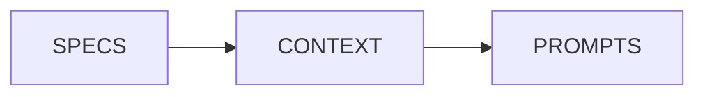
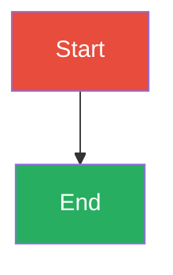

# Gradient Documentation Site

Jekyll-based documentation site for the Gradient architecture framework.

---

## Quick Start

### Prerequisites

- Ruby (≥ 2.7)
- Bundler (`gem install bundler`)

### Local Development

```bash
# Install dependencies
bundle install

# Serve locally with auto-reload
bundle exec jekyll serve

# Access at http://localhost:4000
```

### Build for Production

```bash
# Build static site
bundle exec jekyll build

# Output in _site/
```

---

## Site Structure

```
docs/
├── _config.yml              # Jekyll configuration
├── Gemfile                  # Ruby dependencies
├── index.md                 # Home page
│
├── _pages/                  # Documentation pages
│   ├── quick-start.md       # Getting started guide
│   ├── why-gradient.md      # Problems and philosophy
│   ├── specifications.md    # Technical specifications
│   ├── architecture-guide.md # Complete architecture guide
│   ├── examples.md          # Real-world examples
│   ├── tools.md             # Scripts and agents
│   ├── best-practices.md    # Guidelines and anti-patterns
│   ├── cheatsheet.md        # Quick reference
│   └── migration-guide.md   # Migration strategies
│
├── assets/                  # Static assets
│   ├── css/                 # Custom styles
│   └── images/              # Images (logo, diagrams)
│
├── _includes/               # Reusable components
├── _layouts/                # Page templates
└── _sass/                   # Sass stylesheets
```

---

## Theme and Plugins

### Theme: Minima

Using [Minima theme](https://github.com/jekyll/minima) with custom skin:

```yaml
# _config.yml
theme: minima
minima:
  skin: solarized-light
```

### Plugins

**jekyll-spaceship**: Enables Mermaid diagrams and advanced markdown features

```markdown
# Mermaid diagrams

```

---

## Content Guidelines

### Page Structure

All pages in `_pages/` must have frontmatter:

```markdown
---
layout: page
title: Page Title
nav_order: 3
permalink: /page-slug/
---

# Page Title

Content here...
```

### Mermaid Diagrams

Use Mermaid for architecture diagrams:

```markdown

```

### Color Palette

Consistent colors across diagrams:

- **SPECS**: `#e74c3c` (red)
- **CONTEXT**: `#f39c12` (orange)
- **PROMPTS**: `#27ae60` (green)
- **COMMANDS**: `#3498db` (blue)
- **AGENTS**: `#9b59b6` (purple)
- **SCRIPTS**: `#95a5a6` (gray)
- **HOOKS**: `#34495e` (dark gray)

### Writing Style

- **Smart brevity**: Scannable text without sacrificing density
- **No emojis** unless necessary
- **Technical accuracy**: Precise terminology
- **Abundant diagrams**: Use Mermaid frequently

---

## Navigation

Navigation is configured in `_config.yml`:

```yaml
header_pages:
  - index.md
  - _pages/quick-start.md
  - _pages/why-gradient.md
  - _pages/specifications.md
  - _pages/examples.md
  - _pages/tools.md
```

Pages not in `header_pages` are accessible but not in main navigation.

---

## Contributing

### Adding a New Page

1. Create file in `_pages/`:
   ```bash
   touch _pages/new-page.md
   ```

2. Add frontmatter:
   ```markdown
   ---
   layout: page
   title: New Page
   nav_order: 11
   permalink: /new-page/
   ---
   ```

3. Add to navigation in `_config.yml` (optional)

4. Link from other pages:
   ```markdown
   [New Page]()
   ```

### Updating Existing Pages

1. Edit markdown file in `_pages/`
2. Jekyll auto-reloads (if running `jekyll serve`)
3. Check at `http://localhost:4000`

### Adding Images

1. Place in `assets/images/`
2. Reference in markdown:
   ```markdown
   
   ```

---

## Available Pages

### Essential Pages (Phase 1)

- **quick-start.md**: 10-minute tutorial for creating first Gradient project
- **specifications.md**: Technical overview of all 7 layers
- **architecture-guide.md**: Comprehensive 1,440-line guide with diagrams

### Important Pages (Phase 2)

- **why-gradient.md**: Problem/solution analysis with before/after case studies
- **examples.md**: Real-world implementations (YMD-spec, semantic-docstrings, code-zen)
- **tools.md**: Validation scripts, agents, and commands documentation

### Complementary Pages (Phase 3)

- **best-practices.md**: Guidelines, anti-patterns, and decision frameworks
- **cheatsheet.md**: Quick reference tables, templates, and decision trees
- **migration-guide.md**: Step-by-step migration strategies with examples

---

## Build and Deployment

### GitHub Pages

This site is designed for GitHub Pages deployment:

```yaml
# _config.yml
baseurl: ""
repository: daviguides/gradient
```

### Deployment Workflow

```bash
# 1. Make changes to markdown files
# 2. Test locally
bundle exec jekyll serve

# 3. Commit and push
git add .
git commit -m "Update documentation"
git push origin main

# 4. GitHub Pages builds automatically
```

---

## Troubleshooting

### Bundle Install Fails

```bash
# Update Bundler
gem update bundler

# Clean and reinstall
rm Gemfile.lock
bundle install
```

### Jekyll Serve Errors

```bash
# Clear cache
rm -rf .jekyll-cache _site

# Rebuild
bundle exec jekyll serve
```

### Mermaid Diagrams Not Rendering

Ensure `jekyll-spaceship` is in Gemfile:

```ruby
group :jekyll_plugins do
  gem 'jekyll-spaceship'
end
```

And enabled in `_config.yml`:

```yaml
plugins:
  - jekyll-spaceship

jekyll-spaceship:
  mermaid-processor:
    syntax:
      code: 'mermaid'
```

---

## Resources

- [Jekyll Documentation](https://jekyllrb.com/docs/)
- [Minima Theme](https://github.com/jekyll/minima)
- [Jekyll Spaceship](https://github.com/jeffreytse/jekyll-spaceship)
- [Mermaid Documentation](https://mermaid.js.org/)

---

## License

MIT License - See LICENSE file for details

---

**Gradient Documentation** - Complete architectural framework documentation with interactive examples and comprehensive guides.
