# Gradient Architecture Guide

**For humans: A complete guide to understanding and implementing the Gradient layered context architecture**

---

## Table of Contents

1. [Introduction](#introduction)
2. [The Gradient Metaphor](#the-gradient-metaphor)
3. [Architectural Layers](#architectural-layers)
4. [Layer Transitions](#layer-transitions)
5. [Anti-Duplication Philosophy](#anti-duplication-philosophy)
6. [Reference System](#reference-system)
7. [Composition Patterns](#composition-patterns)
8. [Implementation Guide](#implementation-guide)
9. [Validation and Quality](#validation-and-quality)
10. [Real-World Examples](#real-world-examples)

---

## Introduction

### What is Gradient?

Gradient is an architectural framework for building Claude Code plugins and context injection systems. It emerged from patterns discovered while building projects like `ymd-spec`, `semantic-docstrings`, and `code-zen`.

**Core insight**: Instead of rigid, isolated layers, Gradient promotes **smooth transitions** between architectural layers, like a visual gradient where colors dissolve into each other.

### Why Gradient?

**Problems Solved**:
- Context files repeating specification content
- Redundant explanations across different files
- Unclear boundaries between specifications, context, and prompts
- Maintenance burden when changes require updates in multiple places

**Gradient Solution**:
- Zero duplication through Single Source of Truth (SSOT)
- Clear layer responsibilities with smooth transitions
- Reference-based composition using `@` syntax
- Thin orchestrators that load rather than duplicate

### Who is This Guide For?

- **Plugin developers** building Claude Code extensions
- **Technical writers** organizing documentation
- **Architects** designing context injection systems
- **Teams** seeking maintainable, modular prompt engineering patterns

---

## The Gradient Metaphor

### Visual Representation

```
████████░░░░░░░░  SPECS     (The WHAT - Normative)
    ████████░░░░  CONTEXT   (The HOW - Applied)
        ████████  PROMPTS   (The ACTION - Orchestration)
```

Like a visual gradient, each layer **dissolves into** the next:


### Not Discrete Steps

Gradient is **not**:
- Rigid separation with no overlap
- Mechanical layering (like OSI model)
- Arbitrary divisions
- Waterfall-style sequential processing

Gradient **is**:
- Organic flow of information
- Intentional transitions between concerns
- Fluid boundaries with clear responsibilities
- Each layer having a distinct purpose while blending naturally

### Why "Gradient"?

The name captures several key concepts:

1. **Smooth Transitions**: Like color gradients, layers blend rather than clash
2. **Directionality**: Information flows SPECS → CONTEXT → PROMPTS → EXECUTION
3. **Intentionality**: Each point in the gradient serves a purpose
4. **Machine Learning Connection**: Gradient descent - iterative refinement toward optimal solutions
5. **Visual Metaphor**: Easy to understand and remember

---

## Architectural Layers

### Complete Layer Diagram

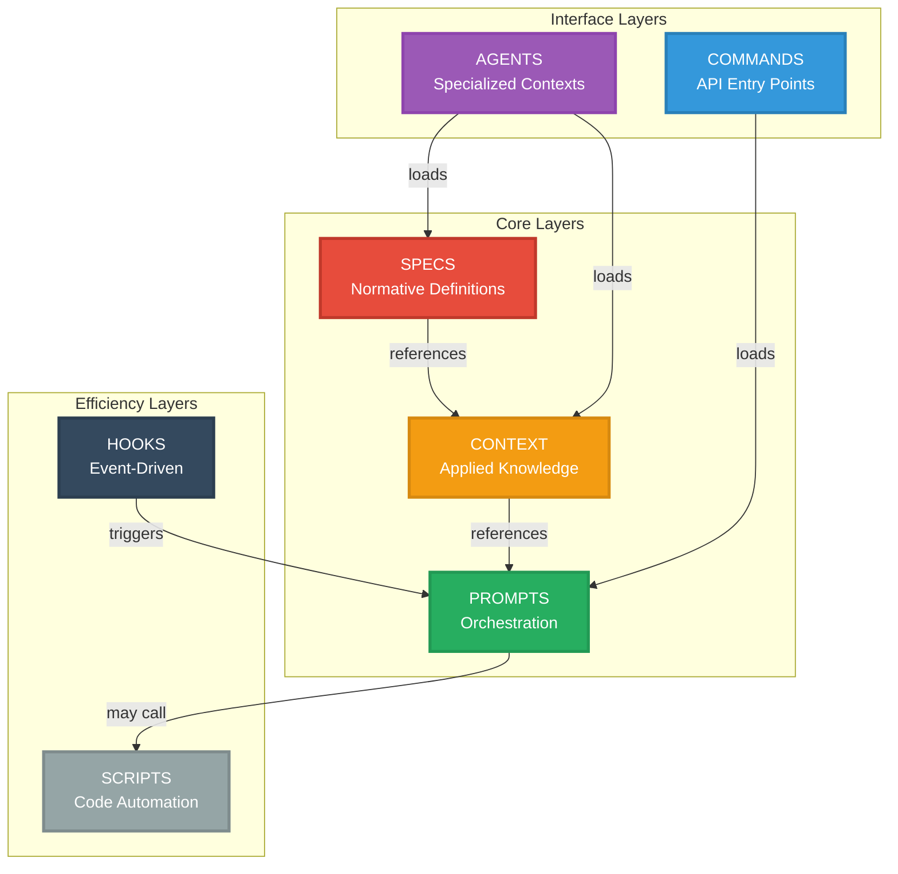

### Layer 1: SPECS (Normative - The WHAT)

**Role**: Authoritative source of truth for format definitions, rules, and standards.

**Contains**:
- Complete format definitions
- Syntax rules
- Validation criteria
- Semantic specifications
- Standards and conventions

**Does NOT contain**:
- Working examples (those belong in CONTEXT)
- Implementation guides (those belong in CONTEXT)
- Orchestration logic (that belongs in PROMPTS)
- Meta-instructions for LLMs (those belong in PROMPTS)

**File Patterns**:
- `*-spec.md` - Format specifications
- `*-principles.md` - Foundational principles
- `*-rules.md` - Normative rules
- `*-standards.md` - Standards definitions

**Example Structure**:
```markdown
# Format Specification

**Purpose**: Define the complete structure and syntax of XYZ format.

## Core Concepts

### File Structure

XYZ files MUST contain:
1. Metadata section (required)
2. Content section (required)
3. Footer section (optional)

### Validation Rules

Valid XYZ file if:
- Contains all required sections
- Metadata fields present and valid
- Syntax follows specification
```

**Validation Metrics**:
- Completeness: 100% (all concepts defined)
- Normative ratio: >80% (normative vs descriptive text)
- Independence: High (minimal external dependencies)

### Layer 2: CONTEXT (Applied - The HOW)

**Role**: Practical application of specifications through examples and guides.

**Contains**:
- Working examples
- Implementation patterns
- Decision trees
- Practical guides
- Best practices in action

**Does NOT contain**:
- Syntax definitions (those are in SPECS)
- Format rules (those are in SPECS)
- Normative statements (those are in SPECS)
- Orchestration logic (that is in PROMPTS)

**File Patterns**:
- `examples.md` - Complete working examples
- `*-guide.md` - Implementation/decision guides
- `patterns.md` - Architectural patterns
- `faq.md` - Common questions with applied answers

**Example Structure**:
```markdown
# Implementation Guide

**For format specifications**: @../project/spec/format-spec.md

## Getting Started

To create your first file:
1. Define metadata (see format spec for requirements)
2. Add content sections
3. Validate structure

### Example Setup

```yaml
meta:
  id: my_first_file
  version: 1.0.0
```

## Common Patterns

### Pattern 1: Simple Structure
[Applied example with explanation]
```

**Validation Metrics**:
- Reference ratio: >30% (references to SPECS)
- Unique value: High (not duplicating specs)
- Completeness: 100% (examples work)
- Practical utility: High (solves real problems)

### Layer 3: PROMPTS (Orchestration - The ACTION)

**Role**: Dynamic orchestration that loads specs/context and provides meta-instructions.

**Contains**:
- `@` references to SPECS and CONTEXT
- Meta-instructions for LLMs
- Orchestration logic
- Context loading sequences

**Does NOT contain**:
- Inline spec content (>5 lines per section)
- Inline examples (those are in CONTEXT)
- Any duplicated material from SPECS or CONTEXT

**File Patterns**:
- `load-*.md` - Context loaders
- `*-workflow.md` - Multi-step orchestrations
- `validate-*.md` - Validation prompts

**Example Structure**:
```markdown
# Load Context Prompt

**Purpose**: Load format specifications and implementation knowledge.

## Format Specifications (Normative)

@../project/spec/format-spec.md
@../project/spec/syntax-spec.md

## Applied Knowledge (Practical)

@../context/implementation-guide.md
@../context/examples.md

## Your Task

With these specifications and guides loaded, you can now:
1. Create new files following format spec
2. Validate existing files
3. Guide users on implementation
```

**Validation Metrics**:
- Reference ratio: >50% (@ references / total lines)
- Inline content: <5 lines per section
- Duplication: 0% (no repeated content)
- Clarity: High (task definition clear)

### Layer 4: COMMANDS (API Entry Points)

**Role**: Thin API layer mapping one-to-one with PROMPTS.

**Analogy**: Like REST API routes - define the interface, delegate the logic.

**Structure**:
```markdown
<!-- commands/load-context.md -->
Load project context for development.

@../prompts/load-context.md
```

**Characteristics**:
- Maximum 5 lines total
- Single `@` reference to corresponding PROMPT
- No business logic
- One-to-one mapping with prompts

**Validation**:
- File size: ≤5 lines
- Reference count: Exactly 1
- Logic: 0 (no business logic)

### Layer 5: AGENTS (Specialized Contexts)

**Role**: Spin-off processes with isolated contexts and separate permissions.

**Characteristics**:
- Run independently from main context
- Have separate tool access
- Return summarized results
- Don't contaminate main context with irrelevant details

**Structure**:
```markdown
# Architecture Reviewer Agent

You are an architecture reviewer specialized in Gradient compliance.

## Context

@../gradient/spec/architecture-spec.md
@../gradient/spec/anti-duplication-principles.md

## Your Task

Review the provided project structure for compliance.

## Return Format

Return summary containing:
- Compliance status (pass/fail)
- Issues found (list)
- Recommendations (list)
```

**Validation**:
- Clear role definition
- References needed specs/context
- Specifies return format
- Self-contained instructions

### Layer 6: SCRIPTS (Efficiency Layer)

**Role**: Code execution when more efficient than LLM tokens.

**When to Use**:
- Repetitive tasks (e.g., file system scans)
- Performance-critical operations (e.g., large file processing)
- Validation logic (e.g., format checking)
- Automation (e.g., bulk operations)

**Structure**:
```bash
#!/bin/bash
# Script: validate-structure.sh
# Purpose: Validate Gradient project structure compliance
# Usage: validate-structure.sh <project-path>

set -e

PROJECT_PATH="$1"

if [ -z "$PROJECT_PATH" ]; then
    echo "Usage: validate-structure.sh <project-path>"
    exit 1
fi

# Validation logic
required_dirs=("spec" "context" "prompts")

for dir in "${required_dirs[@]}"; do
    if [ ! -d "$PROJECT_PATH/$dir" ]; then
        echo "ERROR: Missing required directory: $dir"
        exit 1
    fi
done

echo "Structure validation passed"
```

**Validation**:
- Single responsibility
- Error handling present
- Usage documented
- Exit codes meaningful

### Layer 7: HOOKS (Event-Driven)

**Role**: Lifecycle event handlers for automated workflows.

**Events**:
- Pre-command execution
- Post-command execution
- File changes
- Context switches

**Structure**:
```markdown
# Pre-Command Validation Hook

**Triggered on**: Before command execution

**Purpose**: Validate architecture compliance before running commands.

## Action

@../prompts/validate-architecture.md

## Configuration

Skip validation for commands:
- help
- version
```

**Characteristics**:
- Lightweight (avoid heavy processing)
- Clear trigger event
- References PROMPTS for logic

---

## Layer Transitions

### Information Flow Diagram

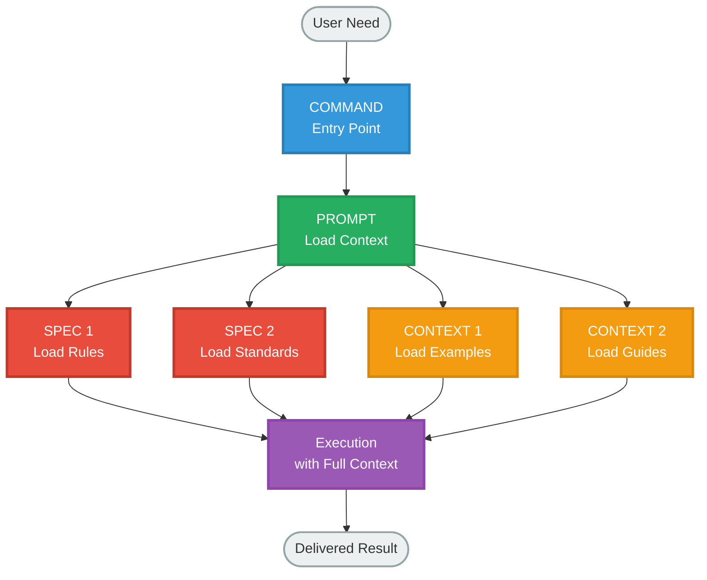

### Transition Examples

#### SPECS → CONTEXT Transition

**SPECS (Normative)**:
```markdown
## Metadata Structure

YMD files MUST contain a `meta:` section with:
- `id`: Unique identifier (snake_case)
- `version`: Semantic version (MAJOR.MINOR.PATCH)
- `title`: Human-readable title
```

**↓ Smooth Transition ↓**

**CONTEXT (Applied)**:
```markdown
For metadata requirements: @../ymd-spec/ymd_format_spec.md

### Example Metadata

```yaml
meta:
  id: code_review_workflow
  version: 1.2.0
  title: Code Review Assistant
```

**Best practices**:
- Use descriptive IDs (avoid abbreviations)
- Follow semver strictly
- Keep titles under 60 characters
```

**Key observation**: CONTEXT references SPECS, adds examples, provides best practices - no duplication of rules.

#### CONTEXT → PROMPTS Transition

**CONTEXT (Applied)**:
```markdown
# Implementation Guide

## Creating Your First YMD

1. Start with metadata
2. Add standard sections (system, instructions)
3. Include PMD components
4. Validate structure

### Complete Example

[50 lines of working example]
```

**↓ Smooth Transition ↓**

**PROMPTS (Orchestration)**:
```markdown
# Create YMD Prompt

## Specifications

@../ymd-spec/ymd_format_spec.md

## Implementation Guidance

@../context/implementation-guide.md
@../context/examples.md

## Your Task

Guide the user in creating a YMD file:
1. Gather requirements (purpose, sections needed)
2. Reference implementation guide for patterns
3. Use examples for structure inspiration
4. Validate against format spec
```

**Key observation**: PROMPTS references both SPECS and CONTEXT, adds orchestration logic, provides meta-instructions - no content duplication.

### Reference Flow Diagram

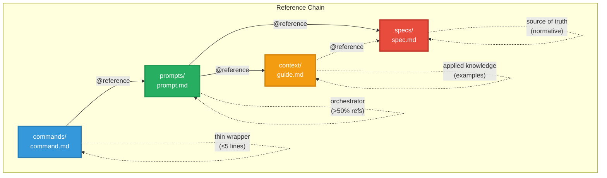

---

## Anti-Duplication Philosophy

### The Core Problem

Traditional documentation structures suffer from:

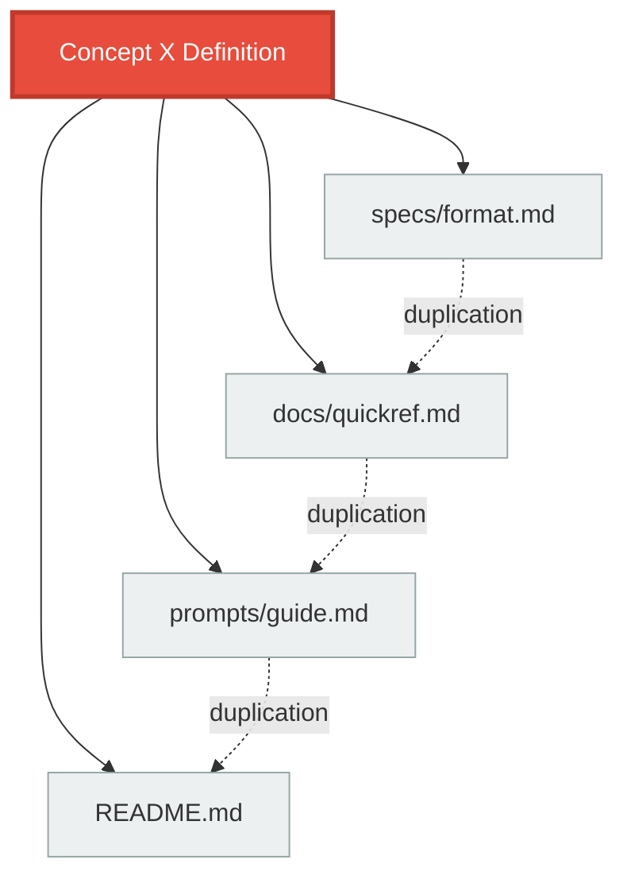

**Problems**:
- Maintenance burden (update in 4 places)
- Inconsistencies (versions drift)
- Cognitive load (which is authoritative?)
- Token waste (for LLMs)

### Single Source of Truth (SSOT)

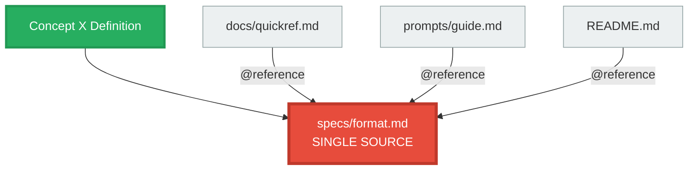

**Benefits**:
- Update once, propagates everywhere
- No inconsistencies possible
- Clear authority
- Efficient token usage

For complete anti-duplication principles: @../gradient/spec/anti-duplication-principles.md

### Detection Decision Tree

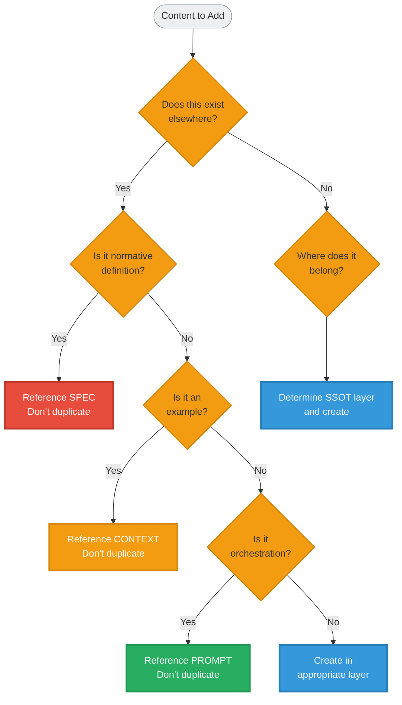

### Refactoring Workflow

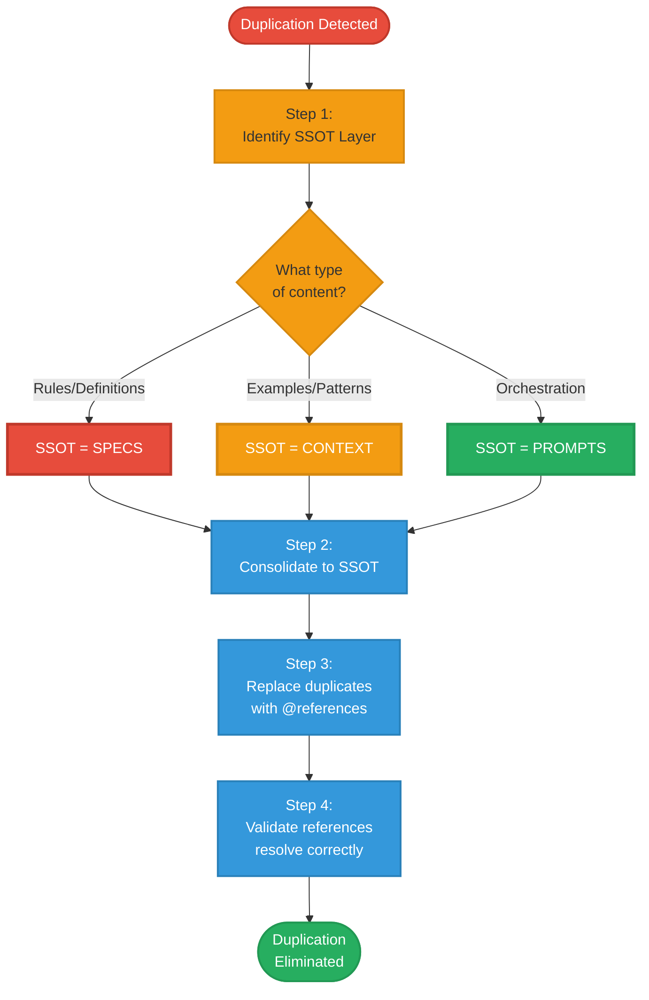

---

## Reference System

### The `@` Syntax

Gradient uses `@` for file references, similar to imports in programming:

**Absolute references** (from installed location):
```markdown
@~/.claude/gradient/gradient/spec/architecture-spec.md
```

**Relative references** (within project):
```markdown
@../gradient/spec/architecture-spec.md
@./examples.md
```

### Reference Resolution

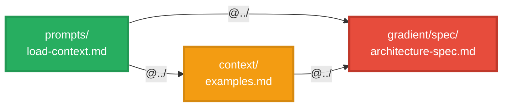

**Resolution rules**:
1. Paths are relative to current file
2. Use `../` to go up directories
3. Use `./` for same directory
4. Never use system-absolute paths

### Reference Patterns

#### Pattern 1: Thin Loader

```markdown
<!-- prompts/load-context.md -->

## Specifications (Normative)

@../project/spec/format-spec.md
@../project/spec/validation-spec.md

## Applied Knowledge (Practical)

@../context/examples.md
@../context/implementation-guide.md

## Your Task

[Brief meta-instructions]
```

**Characteristics**:
- Majority is references (>50%)
- Brief section introductions (<5 lines)
- Clear organization (Specs → Context → Task)

#### Pattern 2: Conditional Loading

```markdown
<!-- prompts/adaptive-load.md -->


@../project/spec/detailed-spec.md

@../context/quick-guide.md

```

**Use cases**:
- Different user expertise levels
- Performance optimization
- Context-specific needs

#### Pattern 3: Layered Loading

```markdown
<!-- prompts/comprehensive-load.md -->

## Layer 1: Normative (SPECS)

@../project/spec/core-spec.md

## Layer 2: Applied (CONTEXT)

@../context/implementation-guide.md
@../context/examples.md

## Layer 3: Orchestration

[Meta-instructions for LLM]
```

**Benefits**:
- Clear mental model
- Organized by layer type
- Easy to understand purpose

---

## Composition Patterns

### Project Structure

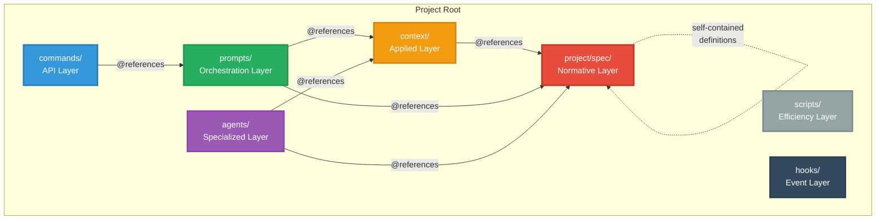

### Directory Structure

```
project/
├── project/spec/           # SPECS (normative)
│   ├── format-spec.md
│   ├── principles.md
│   └── standards.md
│
├── context/                # CONTEXT (applied)
│   ├── examples.md
│   ├── implementation-guide.md
│   └── decision-guide.md
│
├── prompts/                # PROMPTS (orchestration)
│   ├── load-context.md
│   └── workflow.md
│
├── commands/               # COMMANDS (API)
│   └── command-name.md
│
├── agents/                 # AGENTS (specialized)
│   └── agent-name.md
│
├── scripts/                # SCRIPTS (efficiency)
│   └── utility.sh
│
└── hooks/                  # HOOKS (events)
    └── event.md
```

### Naming Conventions

#### SPECS Layer

- `*-spec.md` - Format specifications
- `*-principles.md` - Foundational principles
- `*-standards.md` - Standards definitions

**Examples**:
- `format-spec.md`
- `architecture-spec.md`
- `anti-duplication-principles.md`

#### CONTEXT Layer

- `examples.md` - Working examples
- `*-guide.md` - Implementation guides
- `patterns.md` - Design patterns
- `faq.md` - Frequently asked questions

**Examples**:
- `implementation-guide.md`
- `decision-guide.md`
- `examples.md`

#### PROMPTS Layer

- `load-*.md` - Context loaders
- `*-workflow.md` - Multi-step processes
- `validate-*.md` - Validation prompts

**Examples**:
- `load-context.md`
- `create-workflow.md`
- `validate-structure.md`

---

## Implementation Guide

### Starting a New Gradient Project

#### Step 1: Create Directory Structure

```bash
mkdir -p my-project/{project-spec,context,prompts,commands,agents,scripts,hooks,docs}
```

#### Step 2: Create Specifications First

**Why specs first?**
- Specs define the rules for the entire project
- Other layers reference specs
- Bootstrap problem: specs validate themselves

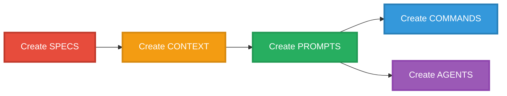

**Start with**:
1. `project/spec/core-spec.md` - Your main specification
2. `project/spec/principles.md` - Foundational principles (if needed)

#### Step 3: Add Context

Create applied knowledge that references your specs:

```markdown
<!-- context/implementation-guide.md -->

# Implementation Guide

**For format rules**: @../project/spec/core-spec.md

## Getting Started

[Step-by-step guide with examples]
```

#### Step 4: Create Thin Prompts

Build orchestrators that load specs and context:

```markdown
<!-- prompts/load-context.md -->

@../project/spec/core-spec.md
@../context/implementation-guide.md

## Your Task

[Meta-instructions for LLM]
```

#### Step 5: Add Commands (API Layer)

Create thin entry points:

```markdown
<!-- commands/load-context.md -->

Load project context.

@../prompts/load-context.md
```

### Migration from Existing Projects

#### Assessment Phase

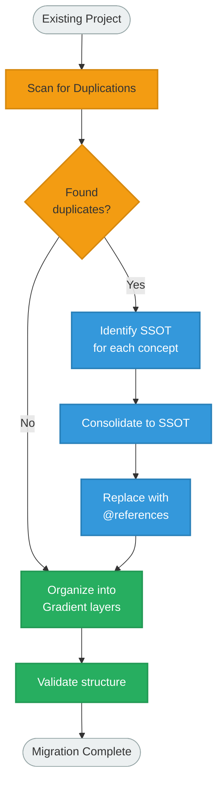

#### Migration Steps

**1. Audit existing files**:
```bash
# Find potential duplications
grep -r "key concept" --include="*.md" .
```

**2. Create SSOT mapping**:
```
Concept X → specs/format-spec.md (lines 45-67)
Concept Y → context/examples.md (example #3)
```

**3. Consolidate and reference**:
- Move all instances to SSOT
- Replace duplicates with `@` references
- Validate references resolve

**4. Reorganize into layers**:
- Move normative content → `project/spec/`
- Move examples → `context/`
- Create thin prompts → `prompts/`

### Best Practices

#### Do's

- **Create specs first** (bootstrap correctly)
- **Reference liberally** (default to @, not duplication)
- **Keep prompts thin** (>50% references)
- **One concept, one location** (SSOT always)
- **Validate references** (ensure they resolve)

#### Don'ts

- **Don't create quick reference files** (LLMs don't need them)
- **Don't duplicate for convenience** (creates maintenance burden)
- **Don't put business logic in commands** (keep them thin)
- **Don't skip validation** (catches broken references early)
- **Don't forget the "why"** (document decisions)

---

## Validation and Quality

### Quality Metrics

#### Layer-Specific Metrics

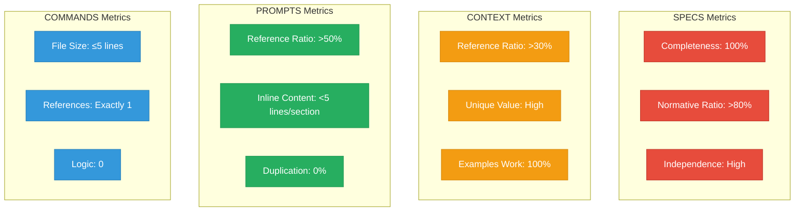

#### Duplication Metrics

**Duplication Ratio**:
```
Total Lines / Unique Information Lines = Duplication Ratio

Target: ≤ 1.1 (10% acceptable overlap for context)
Warning: > 1.2 (20% duplication indicates issues)
Danger: > 1.3 (30% duplication requires refactoring)
```

**Reference Density (for PROMPTS)**:
```
@ References / Total Lines

Target: > 0.5 (majority should be references)
Warning: 0.3-0.5 (moderate inline content)
Danger: < 0.3 (too much duplication)
```

### Validation Checklist

For complete validation rules: @../gradient/spec/architecture-spec.md

#### Project-Wide Checks

- [ ] Zero duplication (each concept in one place)
- [ ] All `@` references resolve
- [ ] Clear SSOT for every concept
- [ ] Layers respect boundaries
- [ ] No circular dependencies

#### Per-File Checks

**SPECS Files**:
- [ ] Normative content only
- [ ] Complete definitions
- [ ] No working examples
- [ ] No orchestration

**CONTEXT Files**:
- [ ] References SPECS for rules
- [ ] Unique applied value
- [ ] Complete working examples
- [ ] No spec redefinition

**PROMPTS Files**:
- [ ] Majority `@` references
- [ ] <5 lines inline content per section
- [ ] Meta-instructions clear
- [ ] No content duplication

**COMMANDS Files**:
- [ ] Single `@` reference to PROMPT
- [ ] <5 lines total
- [ ] No business logic

### Automated Validation

#### Reference Validation Script

```bash
#!/bin/bash
# validate-references.sh

# Find all @ references
find . -name "*.md" -exec grep -l "@" {} \; | while read file; do
    echo "Checking references in: $file"

    # Extract @ references
    grep -o "@[^[:space:]]*" "$file" | while read ref; do
        # Remove @ prefix
        path="${ref:1}"

        # Resolve relative path
        dir=$(dirname "$file")
        full_path="$dir/$path"

        # Check if file exists
        if [ ! -f "$full_path" ]; then
            echo "ERROR: Broken reference in $file"
            echo "       Reference: $ref"
            echo "       Resolved to: $full_path"
            exit 1
        fi
    done
done

echo "All references valid"
```

#### Duplication Detection

```bash
#!/bin/bash
# detect-duplication.sh

# Find similar content across files
# (Simplified - real implementation would use fuzzy matching)

echo "Scanning for potential duplications..."

# Extract key phrases from all markdown files
find . -name "*.md" -exec grep -h "^##\|^###" {} \; | sort | uniq -c | sort -rn

echo "Review sections with count > 1 for potential duplication"
```

---

## Real-World Examples

### Example 1: YMD-Spec Project

**Context**: YMD/PMD format specification plugin for Claude Code.

**Gradient Implementation**:

```
ymd-spec/
├── ymd_format_spec.md      # SPECS: YMD normative definition
├── pmd_format_spec.md      # SPECS: PMD normative definition
├── composition_spec.md     # SPECS: How they compose
│
├── context/
│   ├── examples.md         # CONTEXT: Working examples
│   ├── implementation-guide.md
│   └── decision-guide.md
│
├── prompts/
│   └── load-context.md     # PROMPTS: Thin orchestrator
│
└── commands/
    └── load-ymd-context.md # COMMANDS: Entry point
```

**Reference Chain**:
```markdown
<!-- commands/load-ymd-context.md -->
@~/.claude/ymd-spec/prompts/load-context.md

<!-- prompts/load-context.md -->
@../ymd_format_spec.md
@../pmd_format_spec.md
@../composition_spec.md
@../context/examples.md
```

**Result**: Zero duplication, clear separation of concerns.

### Example 2: Semantic Docstrings Project

**Context**: Python docstring standards plugin.

**Gradient Implementation**:

```
semantic-docstrings/
├── semantic-docstrings-spec/
│   ├── docstring-standards.md   # SPECS: Normative rules
│   └── style-guide.md           # SPECS: Style requirements
│
├── context/
│   ├── python-examples.md       # CONTEXT: Python-specific
│   └── implementation-patterns.md
│
└── prompts/
    └── load-semantic-context.md # PROMPTS: Orchestrator
```

**Benefits**:
- Standards evolve independently
- Examples reference standards (stay synchronized)
- Prompts load both without duplication

### Example 3: Code-Zen Project

**Context**: Zen of Python implementation guide.

**Gradient Implementation**:

```
code-zen/
├── zen-spec/
│   ├── zen-principles.md        # SPECS: The 19 principles
│   └── python-standards.md      # SPECS: Python specifics
│
├── context/
│   ├── zen-applied.md           # CONTEXT: How to apply
│   ├── examples.md              # CONTEXT: Code examples
│   └── anti-patterns.md         # CONTEXT: What to avoid
│
└── prompts/
    └── load-zen-context.md      # PROMPTS: Load all
```

**Insight**: Separating principles (SPECS) from application (CONTEXT) allows:
- Principles remain stable
- Examples evolve with community practices
- Clear distinction between WHAT and HOW

### Migration Case Study: Refactoring YMD-Spec

**Before Gradient**:

```
ymd-spec/
├── ymd_format_spec.md        # 500 lines (mixed spec + examples)
├── quick-reference.md        # 300 lines (duplicated spec summary)
└── prompts/
    └── load-context.md       # 400 lines (duplicated spec content)
```

**Issues**:
- 1200 total lines
- ~600 lines of duplication (50% duplication ratio)
- Maintenance nightmare (update in 3 places)

**After Gradient**:

```
ymd-spec/
├── ymd_format_spec.md        # 400 lines (pure spec, no examples)
├── context/
│   └── examples.md           # 300 lines (unique examples)
└── prompts/
    └── load-context.md       # 50 lines (mostly @references)
```

**Results**:
- 750 total lines (37% reduction)
- 0 lines of duplication (0% duplication ratio)
- Update once, propagates everywhere
- Clear SSOT for every concept

**Metrics**:

| Metric | Before | After | Improvement |
|--------|--------|-------|-------------|
| Total Lines | 1200 | 750 | 37% reduction |
| Duplication Ratio | 2.0 | 1.0 | 50% improvement |
| Maintenance Points | 3 | 1 | 66% reduction |
| Reference Density (prompts) | 0% | 80% | N/A |

---

## Conclusion

### Key Takeaways

1. **Gradient is about smooth transitions**, not rigid layers
2. **SSOT eliminates duplication** and maintenance burden
3. **Reference-based composition** (`@` syntax) enables modularity
4. **Thin orchestrators** (prompts >50% references) keep things maintainable
5. **Bootstrap correctly**: Create SPECS first, then use them to validate everything else

### When to Use Gradient

**Ideal for**:
- Claude Code plugins
- Large documentation projects
- Modular prompt engineering
- Multi-file context systems
- Projects requiring maintainability

**Not necessary for**:
- Single-file projects
- Disposable scripts
- One-off prompts
- Trivial documentation

### Further Reading

**Specifications** (for LLMs):
- @../gradient/spec/architecture-spec.md - Complete architecture specification
- @../gradient/spec/anti-duplication-principles.md - Universal principles
- @../gradient/spec/layer-spec.md - Technical layer specifications

**Documentation** (for humans):
- @./getting-started.md - Quick start guide
- @./index.md - Documentation homepage

**Examples**:
- ymd-spec project - Real-world implementation
- semantic-docstrings project - Standards application
- code-zen project - Principles application

---

## Appendix: Complete Reference

### Glossary

- **SSOT**: Single Source of Truth - one authoritative location per concept
- **Gradient**: Smooth transitions between architectural layers
- **Reference**: `@` syntax for including content from other files
- **Layer**: Architectural component with specific responsibility
- **Thin Orchestrator**: File with >50% references, minimal inline content
- **Duplication Ratio**: Total lines / Unique information lines

### Quick Reference Chart

| Layer | Purpose | Contains | References | File Patterns |
|-------|---------|----------|------------|---------------|
| SPECS | Normative (WHAT) | Definitions, rules | None | `*-spec.md`, `*-principles.md` |
| CONTEXT | Applied (HOW) | Examples, guides | SPECS | `examples.md`, `*-guide.md` |
| PROMPTS | Orchestration (ACTION) | @refs, meta-instructions | SPECS, CONTEXT | `load-*.md`, `*-workflow.md` |
| COMMANDS | API entry | Single @ref | PROMPTS | `command-name.md` |
| AGENTS | Specialized | Role + @refs | SPECS, CONTEXT | `agent-name.md` |
| SCRIPTS | Automation | Code | None | `*.sh`, `*.py` |
| HOOKS | Events | Trigger + @ref | PROMPTS | `event-name.md` |

### Validation Targets Summary

| Metric | SPECS | CONTEXT | PROMPTS | COMMANDS |
|--------|-------|---------|---------|----------|
| Completeness | 100% | 100% | N/A | N/A |
| Reference Ratio | 0% | >30% | >50% | 100% |
| Normative Ratio | >80% | N/A | N/A | N/A |
| Inline Content | N/A | N/A | <5 lines/section | 0 |
| File Size | N/A | N/A | N/A | ≤5 lines |
| Duplication | 0% | 0% | 0% | 0% |

---

**Gradient** - Smooth transitions from specs to action.
