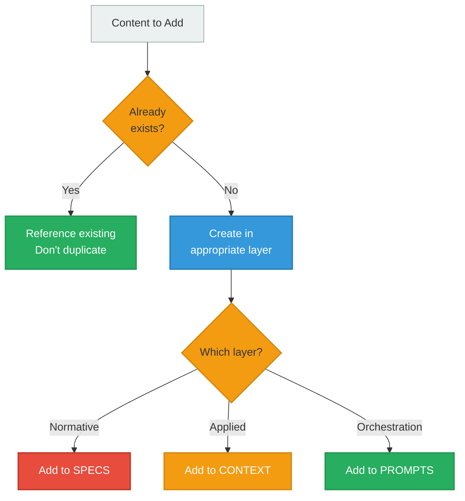
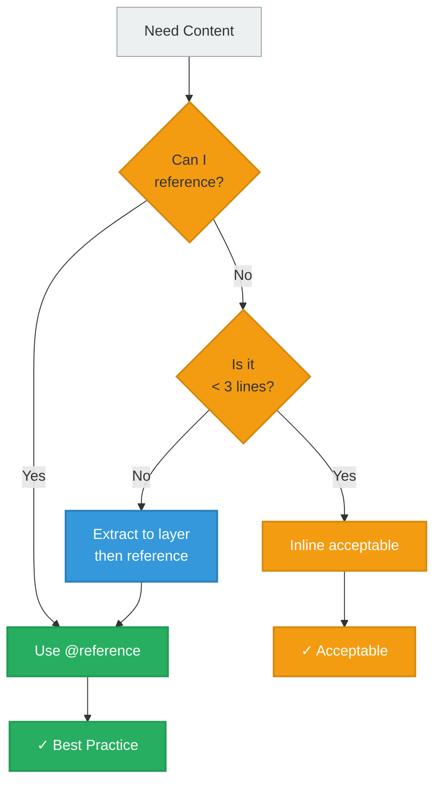
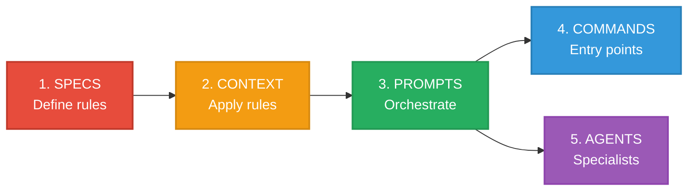
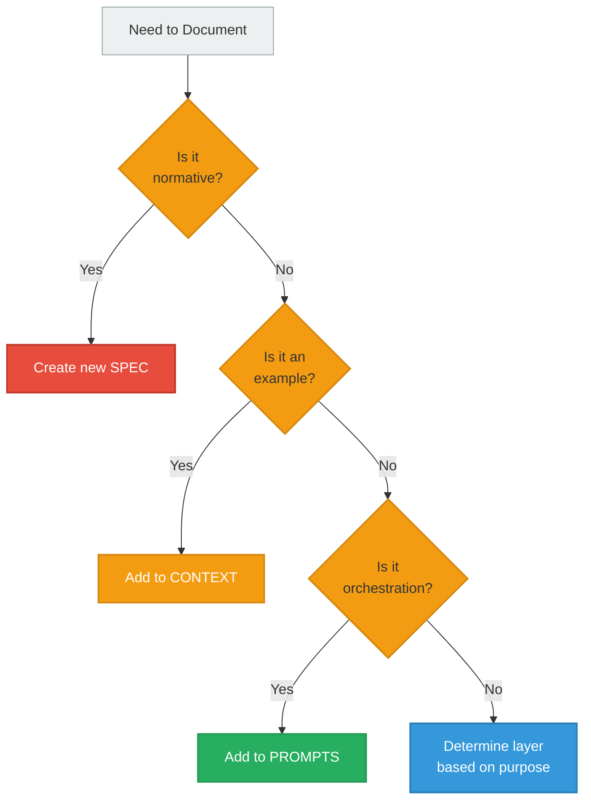
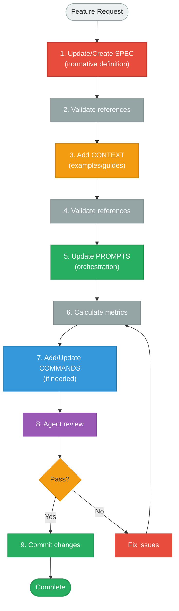

# Best Practices

Guidelines, anti-patterns, and decision-making frameworks for building maintainable Gradient architectures.

---

## Core Principles

### Principle 1: Single Source of Truth (SSOT)

**Every concept exists in exactly one authoritative location.**



**Best practice**:
- Before adding content, search for existing definitions
- If found, reference it with `@` syntax
- If not found, create it in the appropriate layer
- Never duplicate "for convenience"

### Principle 2: Reference Over Duplication

**Default to referencing. Only inline when absolutely necessary.**

**Decision tree**:


**Guidelines**:
- **<3 lines**: Inline acceptable (brief context)
- **3-5 lines**: Consider extracting
- **>5 lines**: Must extract and reference

### Principle 3: Specs First

**Create SPECS before other layers.**

**Bootstrap sequence**:


**Rationale**:
- CONTEXT references SPECS (can't exist without specs)
- PROMPTS load both SPECS and CONTEXT
- COMMANDS delegate to PROMPTS
- AGENTS load SPECS and CONTEXT

---

## Do's and Don'ts

### Do's

**Create specs first**
```markdown
✓ Start with normative definitions
✓ Define validation rules
✓ Document constraints
✓ Then create examples that follow specs
```

**Reference liberally**
```markdown
✓ Default to @references
✓ Load specifications dynamically
✓ Keep prompts thin (>50% references)
✓ Reduce duplication to zero
```

**Keep prompts thin**
```markdown
✓ Majority should be references
✓ <5 lines inline content per section
✓ Brief meta-instructions only
✓ Orchestrate, don't duplicate
```

**Validate frequently**
```markdown
✓ Run validate-references.sh after changes
✓ Check duplication ratio regularly
✓ Use architecture-reviewer agent
✓ Catch issues early
```

**Document the "why"**
```markdown
✓ Explain architectural decisions
✓ Document SSOT choices
✓ Note layer assignments
✓ Clarify responsibilities
```

### Don'ts

**Don't create quick reference files**
```markdown
✗ LLMs don't need summaries
✗ Creates duplication burden
✗ Use @references instead
✗ Load full specs dynamically
```

**Don't duplicate for convenience**
```markdown
✗ "Copy-paste is faster" → Technical debt
✗ "Just this once" → Precedent for chaos
✗ "Too small to matter" → Death by 1000 cuts
✗ Always reference SSOT
```

**Don't put business logic in commands**
```markdown
✗ Commands are thin wrappers
✗ Keep them ≤5 lines
✗ Delegate to prompts
✗ One-to-one mapping only
```

**Don't skip validation**
```markdown
✗ "Looks good" ≠ is good
✗ Broken references cause runtime issues
✗ Duplication accumulates silently
✗ Validate before committing
```

**Don't mix layer responsibilities**
```markdown
✗ Specs with inline examples
✗ Context with normative rules
✗ Prompts with spec definitions
✗ Maintain clear boundaries
```

---

## Layer-Specific Best Practices

### SPECS Layer

**What belongs here**:
- Normative definitions (MUST/MUST NOT/SHALL)
- Validation rules
- Format specifications
- Standards and conventions
- Principles and constraints

**What doesn't belong**:
- Working examples (→ CONTEXT)
- Implementation guides (→ CONTEXT)
- Orchestration logic (→ PROMPTS)
- Meta-instructions for LLMs (→ PROMPTS)

**Best practices**:
```markdown
✓ Use normative language (MUST, SHALL)
✓ Be complete and unambiguous
✓ Minimize external dependencies
✓ Validate other layers against specs
✓ Keep specs independent
```

**Anti-pattern example**:
```markdown
<!-- ✗ BAD: Mixing spec with example -->
# Format Specification

Files MUST have a meta section with:
- id (required)
- version (required)

Here's an example:
```yaml
meta:
  id: example
  version: 1.0.0
```
[... 30 more lines of examples ...]
```

**Best practice example**:
```markdown
<!-- ✓ GOOD: Pure specification -->
# Format Specification

Files MUST have a meta section with:
- id (required): Unique identifier in snake_case
- version (required): Semantic version (MAJOR.MINOR.PATCH)

Validation: File is valid if all required fields present and conform to constraints.

For examples: @../context/examples.md
```

### CONTEXT Layer

**What belongs here**:
- Working examples
- Implementation patterns
- Decision guides
- Best practices in action
- Annotated code samples

**What doesn't belong**:
- Normative definitions (→ SPECS)
- Format rules (→ SPECS)
- Orchestration logic (→ PROMPTS)

**Best practices**:
```markdown
✓ Reference specs for rules
✓ Provide complete working examples
✓ Annotate examples with explanations
✓ Show multiple patterns
✓ Keep synchronized with specs (via references)
```

**Anti-pattern example**:
```markdown
<!-- ✗ BAD: Duplicating spec rules -->
# Implementation Guide

## Format Rules

Files must have:
- meta section with id and version
- At least one content section
[... repeating spec content ...]

## Examples

[... examples ...]
```

**Best practice example**:
```markdown
<!-- ✓ GOOD: Referencing specs, adding unique value -->
# Implementation Guide

For format rules: @../project/spec/format-spec.md

## Getting Started

To create your first file:
1. Start with metadata (see format spec for requirements)
2. Add content sections
3. Validate against spec

### Example: Minimal Valid File

```yaml
meta:
  id: my_first_file
  version: 1.0.0

content: |
  Your content here
```

**Why this works**: Meets all requirements from format spec.
```

### PROMPTS Layer

**What belongs here**:
- `@` references to SPECS and CONTEXT
- Meta-instructions for LLMs
- Orchestration logic
- Context loading sequences

**What doesn't belong**:
- Inline spec content (>5 lines)
- Duplicated examples (→ CONTEXT)
- Normative definitions (→ SPECS)

**Best practices**:
```markdown
✓ Keep reference density >50%
✓ <5 lines inline content per section
✓ Brief meta-instructions only
✓ Clear task definitions
✓ Load, don't duplicate
```

**Anti-pattern example**:
```markdown
<!-- ✗ BAD: Too much inline content -->
# Load Context

## Format Rules

Files must have these sections:
- meta (required)
  - id: snake_case identifier
  - version: semver format
- content (required)
  - markdown format
  - can use variables
[... 50 more lines ...]

## Examples

Here's a complete example:
[... 30 more lines ...]

## Your Task

Guide users...
```

**Best practice example**:
```markdown
<!-- ✓ GOOD: Thin orchestrator -->
# Load Context

## Format Specifications (Normative)

@../project/spec/format-spec.md
@../project/spec/validation-spec.md

## Applied Knowledge (Practical)

@../context/examples.md
@../context/implementation-guide.md

## Your Task

With specifications and examples loaded, guide users in:
1. Creating valid files
2. Validating structure
3. Applying best practices
```

### COMMANDS Layer

**What belongs here**:
- Brief description (1 line)
- Single `@` reference to PROMPT
- Nothing else

**Best practices**:
```markdown
✓ Keep ≤5 lines total
✓ Single reference only
✓ No business logic
✓ One-to-one mapping with prompts
```

**Anti-pattern example**:
```markdown
<!-- ✗ BAD: Business logic in command -->
# Create File Command

This command helps create a new file.
First we need to understand what kind of file...
[... explanation ...]

Then we load:
@../prompts/load-context.md

And also load:
@../context/examples.md

And then we...
[... more content ...]
```

**Best practice example**:
```markdown
<!-- ✓ GOOD: Thin wrapper -->
# Create File Command

Create new file following project specifications.

@../prompts/create-file.md
```

---

## Validation Best Practices

### When to Validate

**After every change**:
```bash
# Quick validation after editing
bash ~/.claude/gradient/scripts/validate-references.sh .
```

**Before committing**:
```bash
# Full validation suite
bash ~/.claude/gradient/scripts/validate-references.sh .
bash ~/.claude/gradient/scripts/detect-duplication.sh .
bash ~/.claude/gradient/scripts/calculate-metrics.sh .
```

**Before releasing**:
```bash
# Complete validation including agent review
bash ~/.claude/gradient/scripts/calculate-metrics.sh .

# Then in Claude Code:
# "Use architecture-reviewer agent to validate my project"
```

### Interpreting Metrics

**Duplication Ratio**:
```
1.0-1.1:  ✓ Excellent (0-10% overlap)
1.1-1.2:  ⚠ Warning (10-20% duplication)
1.2-1.3:  ⚠ Concern (20-30% duplication)
>1.3:     ✗ Critical (>30% duplication - refactor required)
```

**Reference Density (PROMPTS)**:
```
>70%:     ✓ Excellent (very thin orchestrator)
50-70%:   ✓ Good (meets target)
30-50%:   ⚠ Acceptable (but consider extracting)
<30%:     ✗ Poor (too much inline content)
```

**Command File Size**:
```
≤3 lines: ✓ Excellent
4-5 lines: ✓ Good
6-10 lines: ⚠ Warning (approaching bloat)
>10 lines: ✗ Critical (contains business logic)
```

---

## Architecture Decisions

### When to Create New SPEC

**Create new spec when**:
- Defining a new format
- Documenting new rules/standards
- Specifying validation criteria
- Establishing conventions

**Don't create spec when**:
- Showing examples (use CONTEXT)
- Documenting implementation steps (use CONTEXT)
- Creating workflows (use PROMPTS)

**Decision tree**:


### When to Split SPEC

**Split when**:
- Single spec grows >500 lines
- Covers multiple distinct domains
- Has multiple independent concepts
- Team members work on different sections simultaneously

**Don't split when**:
- Concepts are tightly coupled
- Splitting would create circular dependencies
- Total size <300 lines

**Example split**:
```
<!-- Before: Single large spec -->
format-spec.md (800 lines)
  - Section 1: Metadata rules (200 lines)
  - Section 2: Content rules (300 lines)
  - Section 3: Validation rules (300 lines)

<!-- After: Split by domain -->
metadata-spec.md (250 lines)
content-spec.md (350 lines)
validation-spec.md (350 lines)
```

### When to Create Agent

**Create agent when**:
- Task requires isolated context
- Need specialized validation
- Want to prevent context contamination
- Task returns structured summary

**Don't create agent when**:
- Task is part of main workflow
- Need interactive back-and-forth
- Simple reference loading suffices

---

## Common Anti-Patterns

### Anti-Pattern 1: Quick Reference Files

**Problem**: Creating summary files for "easy lookup"

```
project/
├── spec.md           # Full specification
└── quickref.md       # Summary of spec  ✗ Duplication
```

**Why it's bad**:
- Duplication burden (update in 2 places)
- Inconsistencies (summary drifts from spec)
- LLMs don't need summaries (can load full spec)
- Violates SSOT principle

**Solution**: Delete quick reference, use `@` references

```
project/
├── spec.md           # Full specification (SSOT)
└── prompts/
    └── load.md       # @../spec.md  ✓ Reference
```

### Anti-Pattern 2: Mixed Layer Files

**Problem**: Files that mix SPECS + CONTEXT + PROMPTS

```markdown
<!-- ✗ format-spec.md - Everything mixed -->

# Format Specification

## Rules (SPECS content)
Files MUST have...
[normative definitions]

## Examples (CONTEXT content)
Here's how to create...
[working examples]

## Usage (PROMPTS content)
To use this in Claude Code...
[meta-instructions]
```

**Why it's bad**:
- Unclear responsibilities
- Hard to reference specific parts
- Changes to one aspect affect others
- Violates layer boundaries

**Solution**: Separate into layers

```markdown
<!-- ✓ project/spec/format-spec.md (SPECS only) -->
# Format Specification
Files MUST have...
[normative definitions only]

<!-- ✓ context/examples.md (CONTEXT only) -->
# Format Examples
For rules: @../project/spec/format-spec.md
[working examples only]

<!-- ✓ prompts/load-context.md (PROMPTS only) -->
# Load Context
@../project/spec/format-spec.md
@../context/examples.md
[brief meta-instructions only]
```

### Anti-Pattern 3: Bloated Commands

**Problem**: Commands containing business logic

```markdown
<!-- ✗ commands/create-file.md -->

Create new file following specifications.

## Steps

1. First, gather requirements...
2. Then, validate inputs...
3. Next, create structure...
[... 50 lines of orchestration logic ...]

@../prompts/create-file.md
```

**Why it's bad**:
- Exceeds 5-line limit
- Contains business logic
- Should be in PROMPTS, not COMMANDS
- Not a thin wrapper

**Solution**: Move logic to PROMPTS

```markdown
<!-- ✓ commands/create-file.md -->
Create new file following specifications.

@../prompts/create-file.md

<!-- ✓ prompts/create-file.md -->
# Create File Workflow

@../project/spec/format-spec.md
@../context/examples.md

## Your Task

Guide user through file creation:
1. Gather requirements
2. Validate inputs
3. Create structure
[orchestration logic here, with references]
```

### Anti-Pattern 4: Circular References

**Problem**: Files referencing each other in a loop

```markdown
<!-- ✗ spec.md -->
@./context/examples.md

<!-- ✗ context/examples.md -->
@../spec.md
@./guide.md

<!-- ✗ context/guide.md -->
@./examples.md
@../spec.md
```

**Why it's bad**:
- Infinite loop
- Unclear dependency order
- Hard to understand flow

**Solution**: Establish clear hierarchy

```markdown
<!-- ✓ spec.md (SPECS - no references to other layers) -->
# Specification
[normative definitions]

<!-- ✓ context/examples.md (CONTEXT - references SPECS only) -->
For rules: @../spec.md
[examples]

<!-- ✓ prompts/load.md (PROMPTS - references both) -->
@../spec.md
@../context/examples.md
[meta-instructions]
```

**Rule**: References flow PROMPTS → CONTEXT → SPECS (never backwards)

---

## Workflow Best Practices

### Development Workflow



### Refactoring Workflow

**Detect → Identify → Consolidate → Replace → Validate**

1. **Detect**: Run duplication detection
   ```bash
   bash detect-duplication.sh my-plugin/
   ```

2. **Identify**: Determine SSOT for duplicated content
   - Normative? → SPECS
   - Applied? → CONTEXT
   - Orchestration? → PROMPTS

3. **Consolidate**: Move all instances to SSOT

4. **Replace**: Replace duplicates with `@` references

5. **Validate**: Ensure references resolve and metrics pass
   ```bash
   bash validate-references.sh my-plugin/
   bash calculate-metrics.sh my-plugin/
   ```

---

## Next Steps

- **[Cheatsheet]()** - Quick reference for common patterns
- **[Migration Guide]()** - Refactoring existing projects
- **[Tools]()** - Validation scripts and agents

---

**Key Takeaway**: Follow SSOT rigorously, reference over duplication, validate frequently, and maintain clear layer boundaries. These practices ensure maintainable, scalable Gradient architectures.
