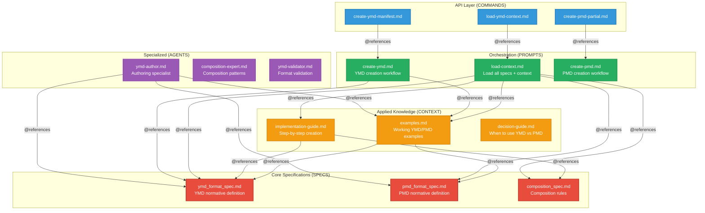
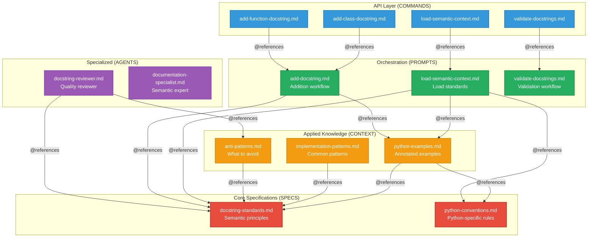
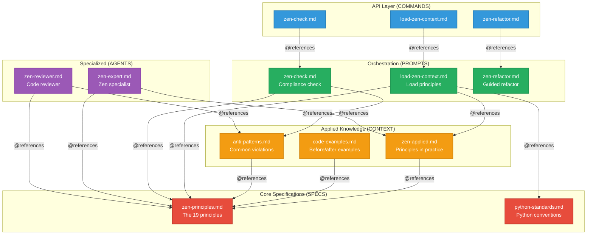
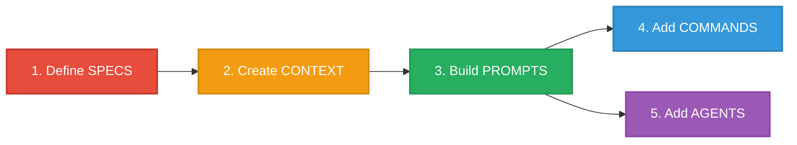

# Real-World Examples

Gradient emerged from patterns discovered while building Claude Code plugins. These real-world examples demonstrate the architecture in practice.

---

## Example 1: YMD-Spec Plugin

**Purpose**: Format specification and authoring tools for YMD/PMD structured prompts.

**Repository**: [daviguides/ymd-spec](https://github.com/daviguides/ymd-spec)

### Architecture



### Directory Structure

```
ymd-spec/
├── ymd_format_spec.md          # SPECS: YMD normative definition
├── pmd_format_spec.md          # SPECS: PMD normative definition
├── composition_spec.md         # SPECS: Composition rules
│
├── context/                    # CONTEXT: Applied knowledge
│   ├── examples.md            # Working YMD/PMD examples
│   ├── implementation-guide.md # Creation step-by-step
│   ├── decision-guide.md      # When to use what
│   └── quick-reference.md     # Fast lookup patterns
│
├── prompts/                    # PROMPTS: Orchestration
│   ├── load-context.md        # Main context loader
│   ├── create-ymd.md          # YMD creation workflow
│   ├── create-pmd.md          # PMD creation workflow
│   └── validate-composition.md # Validation workflow
│
├── commands/                   # COMMANDS: API entry points
│   ├── load-ymd-context.md
│   ├── create-ymd-manifest.md
│   ├── create-pmd-partial.md
│   └── validate-composition.md
│
├── agents/                     # AGENTS: Specialized contexts
│   ├── ymd-author.md          # Authoring specialist
│   ├── composition-expert.md  # Composition patterns expert
│   └── ymd-validator.md       # Format validator
│
└── cheatsheet/                 # Quick lookup tables
    ├── ymd-sections.md
    └── jinja2-syntax.md
```

### Reference Chain Example

**User invokes command**:
```bash
/create-ymd-manifest
```

**Command delegates to prompt**:
```markdown
<!-- commands/create-ymd-manifest.md -->
Create new YMD manifest file.

@~/.claude/ymd-spec/prompts/create-ymd.md
```

**Prompt loads specs and context**:
```markdown
<!-- prompts/create-ymd.md -->
# Create YMD Manifest

## Format Specifications (Normative)

@../ymd_format_spec.md

## Applied Knowledge (Practical)

@../context/examples.md
@../context/implementation-guide.md

## Your Task

Guide the user in creating a YMD manifest file:
1. Gather requirements (purpose, sections needed)
2. Use examples for structure inspiration
3. Validate against format specification
```

**Result**: Zero duplication, clear separation of concerns.

### Metrics

| Metric | Value | Target | Status |
|--------|-------|--------|--------|
| Duplication Ratio | 1.0 | ≤1.1 | ✓ Pass |
| Reference Density (prompts) | 75% | >50% | ✓ Pass |
| Command File Sizes | 3 lines avg | ≤5 lines | ✓ Pass |
| Total Maintenance Points | 3 specs | N/A | Clean SSOT |

---

## Example 2: Semantic Docstrings Plugin

**Purpose**: Python docstring standards following semantic documentation principles.

**Repository**: [daviguides/semantic-docstrings](https://github.com/daviguides/semantic-docstrings)

### Architecture



### Directory Structure

```
semantic-docstrings/
├── semantic-docstrings-spec/   # SPECS: Normative layer
│   ├── docstring-standards.md  # Semantic principles
│   └── python-conventions.md   # Python-specific rules
│
├── context/                    # CONTEXT: Applied layer
│   ├── python-examples.md     # Annotated code examples
│   ├── implementation-patterns.md # Common patterns
│   └── anti-patterns.md       # What to avoid
│
├── prompts/                    # PROMPTS: Orchestration
│   ├── load-semantic-context.md
│   ├── add-docstring.md
│   └── validate-docstrings.md
│
├── commands/                   # COMMANDS: API layer
│   ├── load-semantic-context.md
│   ├── add-class-docstring.md
│   ├── add-function-docstring.md
│   ├── add-module-docstring.md
│   └── validate-docstrings.md
│
└── agents/                     # AGENTS: Specialized
    ├── docstring-reviewer.md
    └── documentation-specialist.md
```

### Key Insight: Standards vs Application

**SPECS layer** (docstring-standards.md):
```markdown
# Semantic Docstring Standards

## Purpose Statement

Every docstring MUST include a purpose statement explaining:
- What the component does
- Why it exists
- What responsibility it fulfills

## Responsibility Section

Functions/classes MUST document:
- Single overarching responsibility
- Boundaries (what it does NOT handle)
- Role in the system architecture
```

**CONTEXT layer** (python-examples.md):
```markdown
# Python Docstring Examples

For standards reference: @../semantic-docstrings-spec/docstring-standards.md

## Example: Function with Clear Purpose

\```python
def calculate_user_discount(
    user: User,
    purchase_amount: Decimal,
) -> Decimal:
    """Calculate discount based on user loyalty and purchase volume.

    Responsibility:
        Compute final discount amount considering multiple factors.

    Boundaries:
        - Does NOT validate user state (handled by caller)
        - Does NOT apply discount to purchase (returns amount only)

    Args:
        user: User account for loyalty tier determination
        amount: Purchase amount for volume-based calculation

    Returns:
        Final discount amount, capped at maximum allowed discount
    """
\```
```

**Benefit**: Standards evolve independently from examples. Update principle → Examples remain valid because they reference standards.

---

## Example 3: Code-Zen Plugin

**Purpose**: Zen of Python implementation guide for code generation.

**Repository**: [daviguides/code-zen](https://github.com/daviguides/code-zen)

### Architecture



### Directory Structure

```
code-zen/
├── zen-spec/                   # SPECS: Normative layer
│   ├── zen-principles.md      # The 19 principles
│   └── python-standards.md    # Python conventions
│
├── context/                    # CONTEXT: Applied layer
│   ├── zen-applied.md         # Principles in practice
│   ├── code-examples.md       # Before/after examples
│   └── anti-patterns.md       # Common violations
│
├── prompts/                    # PROMPTS: Orchestration
│   ├── load-zen-context.md    # Load all context
│   ├── zen-check.md           # Compliance validation
│   └── zen-refactor.md        # Guided refactoring
│
├── commands/                   # COMMANDS: API layer
│   ├── load-zen-context.md
│   ├── zen-check.md
│   └── zen-refactor.md
│
└── agents/                     # AGENTS: Specialized
    ├── python-zen-expert.md   # Zen specialist
    └── zen-reviewer.md        # Code reviewer
```

### Key Insight: Principles vs Application

**SPECS layer** (zen-principles.md):
```markdown
# Zen of Python Principles

## Principle 2: Explicit is better than implicit

**Definition**: Code behavior should be obvious from reading it.
Avoid hidden side effects, implicit type conversions, or magic behavior.

**Applies to**:
- Function signatures (explicit parameters)
- Type hints (explicit types)
- Error handling (explicit raises)
- State changes (explicit mutations)
```

**CONTEXT layer** (zen-applied.md):
```markdown
# Zen Applied: Explicit Over Implicit

For principle definitions: @../zen-spec/zen-principles.md

## Application: Function Signatures

**Implicit (avoid)**:
\```python
def save_user(user, db=None):
    db = db or get_default_db()  # Implicit behavior
    # ...
\```

**Explicit (preferred)**:
\```python
def save_user(
    user: User,
    database: Database,
) -> None:
    """Save user to specified database."""
    # All dependencies explicit
\```
```

**Benefit**: Principles remain stable, application examples evolve with community best practices.

---

## Common Patterns Across Examples

### Pattern 1: Spec-First Architecture

All three examples follow the same bootstrap approach:



**Why this order?**
- SPECS define rules for everything else
- CONTEXT references SPECS (can't exist without specs)
- PROMPTS load both SPECS and CONTEXT
- COMMANDS/AGENTS delegate to PROMPTS

### Pattern 2: Thin Commands

All three examples use identical command pattern:

```markdown
<!-- commands/{command-name}.md -->
Brief description of command purpose.

@../prompts/{corresponding-prompt}.md
```

**Characteristics**:
- ≤5 lines total
- Single `@` reference
- Zero business logic
- One-to-one mapping with prompts

### Pattern 3: Context References Specs

All CONTEXT files reference SPECS for authoritative definitions:

**YMD-Spec**:
```markdown
For format rules: @../ymd_format_spec.md
```

**Semantic Docstrings**:
```markdown
For standards reference: @../semantic-docstrings-spec/docstring-standards.md
```

**Code-Zen**:
```markdown
For principle definitions: @../zen-spec/zen-principles.md
```

**Benefit**: Context stays synchronized with specs automatically.

### Pattern 4: Prompts as Orchestrators

All PROMPTS follow similar structure:

```markdown
# {Purpose}

## Specifications (Normative)

@../spec1.md
@../spec2.md

## Applied Knowledge (Practical)

@../context/examples.md
@../context/guide.md

## Your Task

[Brief meta-instructions for LLM]
```

**Metrics achieved**:
- Reference density: 60-80%
- Inline content: <5 lines per section
- Zero duplication

---

## Comparative Analysis

### Metrics Across Examples

| Metric | YMD-Spec | Semantic-Docstrings | Code-Zen |
|--------|----------|---------------------|----------|
| **Duplication Ratio** | 1.0 | 1.0 | 1.0 |
| **Reference Density (prompts)** | 75% | 68% | 80% |
| **Command Avg Size** | 3 lines | 3 lines | 3 lines |
| **SPECS Count** | 3 | 2 | 2 |
| **CONTEXT Count** | 4 | 3 | 3 |
| **PROMPTS Count** | 4 | 3 | 3 |
| **COMMANDS Count** | 4 | 5 | 3 |
| **AGENTS Count** | 3 | 2 | 2 |

### Consistency Across Projects

All three examples demonstrate:
- **Zero duplication** (duplication ratio = 1.0)
- **Thin orchestrators** (reference density >50%)
- **Command simplicity** (≤5 lines)
- **Clear SSOT** (each concept in one place)
- **Maintainable architecture** (update once, propagate everywhere)

---

## Learning Path

### For New Projects

**Start with**:
1. **YMD-Spec** - If building format specifications
2. **Semantic-Docstrings** - If creating code standards
3. **Code-Zen** - If documenting principles/guidelines

**Adapt patterns**:
- Same directory structure
- Same reference patterns
- Same layer responsibilities
- Same validation metrics

### For Existing Projects

**Migration approach**:
1. Study one example similar to your domain
2. Map your content to Gradient layers
3. Identify duplications
4. Consolidate to SSOT
5. Replace with references
6. Validate metrics

---

## Try It Yourself

### Clone and Explore

**YMD-Spec**:
```bash
git clone https://github.com/daviguides/ymd-spec.git
cd ymd-spec
./install.sh
```

**Semantic-Docstrings**:
```bash
git clone https://github.com/daviguides/semantic-docstrings.git
cd semantic-docstrings
./install.sh
```

**Code-Zen**:
```bash
git clone https://github.com/daviguides/code-zen.git
cd code-zen
./install.sh
```

### Validate Metrics

Run Gradient validation tools on these examples:

```bash
# Validate references
bash ~/.claude/gradient/scripts/validate-references.sh ymd-spec/

# Detect duplication
bash ~/.claude/gradient/scripts/detect-duplication.sh ymd-spec/

# Calculate metrics
bash ~/.claude/gradient/scripts/calculate-metrics.sh ymd-spec/
```

**Expected results**: All pass with zero duplication.

---

## Next Steps

- **[Quick Start]()** - Create your own Gradient project
- **[Tools]()** - Validation scripts and agents
- **[Best Practices]()** - Guidelines for implementation

---

**Key Takeaway**: These real-world examples demonstrate that Gradient is not theoretical—it's a proven architecture used in production Claude Code plugins, achieving zero duplication and maintainable structures.
