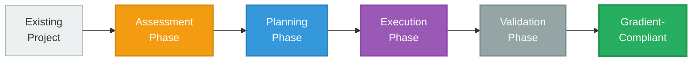

# Migration Guide

Step-by-step guide for refactoring existing projects to follow Gradient architecture.

---

## Overview

Migrating to Gradient eliminates duplication and establishes clear architectural boundaries. This guide covers assessment, planning, and execution.



---

## Phase 1: Assessment

### Analyze Current State

**Run detection scripts**:
```bash
# Clone current project state for backup
cp -r my-plugin my-plugin-backup

cd my-plugin

# Detect duplications
bash ~/.claude/gradient/scripts/detect-duplication.sh .

# Calculate baseline metrics
bash ~/.claude/gradient/scripts/calculate-metrics.sh .
```

**Expected output**:
```
Potential duplication found:
  File 1: docs/format.md (lines 10-45)
  File 2: README.md (lines 50-85)
  Common lines: 35
  Similarity: High

Duplication Ratio: 1.8  (target: ≤1.1)
```

### Identify Duplication Patterns

**Create duplication map**:
```
Concept: "Format Rules"
  Appears in:
    - docs/format.md (lines 10-45) - Full definition
    - README.md (lines 50-85) - Summary
    - prompts/guide.md (lines 15-50) - Repeated inline

SSOT candidate: docs/format.md (most complete)
```

**Document findings**:
```markdown
# Duplication Assessment

## High-Priority Duplications

1. **Format Rules** (35 lines duplicated)
   - SSOT: docs/format.md
   - Duplicates: README.md, prompts/guide.md
   - Action: Consolidate to SPECS layer

2. **Examples** (20 lines duplicated)
   - SSOT: examples/basic.md
   - Duplicates: README.md, prompts/create.md
   - Action: Move to CONTEXT layer

3. **Usage Instructions** (15 lines duplicated)
   - SSOT: README.md
   - Duplicates: docs/quickstart.md, prompts/guide.md
   - Action: Extract to PROMPTS layer
```

### Assess Current Architecture

**Current structure analysis**:
```
my-plugin/
├── docs/
│   ├── format.md          # Mixed (specs + examples)
│   └── quickstart.md      # Mixed (examples + instructions)
├── prompts/
│   ├── guide.md           # Mixed (specs + examples + orchestration)
│   └── create.md          # Bloated (50 lines)
└── README.md              # Mixed (everything)

Issues:
- No clear SSOT (content scattered)
- Mixed layer responsibilities
- High duplication (ratio: 1.8)
- Unclear boundaries
```

---

## Phase 2: Planning

### Define Target Architecture

**Plan layer organization**:
```
my-plugin/
├── my-plugin-spec/        # SPECS (new)
│   ├── format-spec.md     ← Consolidate from docs/format.md
│   └── principles.md      ← Extract from README.md
│
├── context/               # CONTEXT (new)
│   ├── examples.md        ← Consolidate from examples/ + docs/
│   └── implementation-guide.md ← Extract from docs/quickstart.md
│
├── prompts/               # PROMPTS (refactor)
│   ├── load-context.md    ← Thin orchestrator
│   └── create-workflow.md ← Thin orchestrator
│
└── commands/              # COMMANDS (new)
    ├── load-context.md
    └── create-item.md
```

### Create Migration Checklist

```markdown
# Migration Checklist

## Phase 1: SPECS Layer
- [ ] Create my-plugin-spec/ directory
- [ ] Extract format rules from docs/format.md
- [ ] Move to my-plugin-spec/format-spec.md (pure normative)
- [ ] Validate completeness
- [ ] Remove spec content from other files

## Phase 2: CONTEXT Layer
- [ ] Create context/ directory
- [ ] Consolidate examples from all sources
- [ ] Move to context/examples.md
- [ ] Add @references to specs
- [ ] Remove example content from other files

## Phase 3: PROMPTS Layer
- [ ] Refactor prompts/guide.md → prompts/load-context.md
- [ ] Replace inline content with @references
- [ ] Ensure >50% reference density
- [ ] Keep meta-instructions brief (<5 lines/section)

## Phase 4: COMMANDS Layer
- [ ] Create commands/ directory
- [ ] Create thin command wrappers (≤5 lines)
- [ ] Map one-to-one with prompts

## Phase 5: Validation
- [ ] Run validate-references.sh
- [ ] Run calculate-metrics.sh
- [ ] Use architecture-reviewer agent
- [ ] Fix all issues

## Phase 6: Cleanup
- [ ] Remove duplicated content
- [ ] Archive old structure
- [ ] Update documentation
```

### Choose Migration Strategy

#### Strategy 1: Big Bang (Recommended for small projects)

**When to use**:
- Project <10 files
- Can afford downtime
- Want complete refactor at once

**Steps**:
1. Create new structure in parallel
2. Consolidate all content
3. Replace references
4. Switch over completely
5. Delete old structure

**Timeline**: 2-4 hours for small project

#### Strategy 2: Incremental (Recommended for large projects)

**When to use**:
- Project >10 files
- Cannot afford downtime
- Want gradual transition

**Steps**:
1. Create SPECS layer first
2. Migrate to SPECS incrementally
3. Create CONTEXT layer
4. Migrate to CONTEXT incrementally
5. Refactor PROMPTS to reference new layers
6. Clean up old structure

**Timeline**: 1-2 weeks for large project

---

## Phase 3: Execution

### Step 1: Create SPECS Layer

**Create directory**:
```bash
mkdir -p my-plugin-spec
```

**Extract normative content**:
```markdown
<!-- OLD: docs/format.md (mixed) -->
# Format Documentation

Files must have:
- meta section (required)
- content section (required)

Example:
```yaml
meta:
  id: example
```
[... more examples ...]

Usage:
Load this in Claude Code...
[... usage instructions ...]
```

**Extract to pure spec**:
```markdown
<!-- NEW: my-plugin-spec/format-spec.md (pure normative) -->
# Format Specification

**Purpose**: Define complete structure of plugin files.

---

## File Structure

Plugin files MUST contain:
1. Meta section (required)
2. Content section (required)

### Meta Section

Required fields:
- `id`: Unique identifier (snake_case, max 50 chars)
- `version`: Semantic version (MAJOR.MINOR.PATCH)
- `enabled`: Boolean flag

### Content Section

Required fields:
- `type`: Content type (string, enum: text|yaml|json)
- `body`: Content body (string, non-empty)

---

## Validation Rules

Valid file if:
- All required sections present
- All required fields present and valid
- Field constraints satisfied

---

For examples: @../context/examples.md
For implementation: @../context/implementation-guide.md
```

**Validate**:
```bash
# At this point, references won't resolve yet (context/ doesn't exist)
# But spec should be complete
```

### Step 2: Create CONTEXT Layer

**Create directory**:
```bash
mkdir -p context
```

**Consolidate examples**:
```markdown
<!-- NEW: context/examples.md -->
# Plugin File Examples

For format specifications: @../my-plugin-spec/format-spec.md

---

## Example 1: Minimal Valid File

**Purpose**: Demonstrates minimum required fields

```yaml
meta:
  id: minimal_example
  version: 1.0.0
  enabled: true

content:
  type: text
  body: |
    Sample content here
```

**Validates**: All required sections and fields present.

---

## Example 2: Complex File

**Purpose**: Demonstrates optional fields and advanced features

```yaml
meta:
  id: complex_example
  version: 2.1.0
  enabled: true
  author: "John Doe"
  tags: ["production", "verified"]

content:
  type: yaml
  body: |
    key: value
    nested:
      data: true
```

**Validates**: All required fields plus optional fields correctly formatted.

---

## Example 3: Invalid File

**Purpose**: Common mistake - missing required field

```yaml
meta:
  id: invalid_example
  version: 1.0.0
  # Missing 'enabled' field

content:
  type: text
  body: "content"
```

**Fails validation**: Missing required field `enabled` in meta section.
```

**Validate**:
```bash
bash ~/.claude/gradient/scripts/validate-references.sh .
# Should pass: context references specs correctly
```

### Step 3: Refactor PROMPTS Layer

**Before (bloated)**:
```markdown
<!-- OLD: prompts/guide.md (50 lines) -->
# Plugin Guide

## Format Rules

Files must have meta section with:
- id (required)
- version (required)
- enabled (required)
[... 20 lines of spec content ...]

## Examples

Here's a basic example:
[... 15 lines of examples ...]

## Your Task

Guide users in creating files...
[... instructions ...]
```

**After (thin orchestrator)**:
```markdown
<!-- NEW: prompts/load-context.md (12 lines) -->
# Load Plugin Context

**Purpose**: Load plugin specifications and implementation knowledge.

---

## Format Specifications (Normative)

@../my-plugin-spec/format-spec.md

---

## Applied Knowledge (Practical)

@../context/examples.md
@../context/implementation-guide.md

---

## Your Task

With specifications and examples loaded, guide users in creating valid plugin files.
```

**Validate**:
```bash
bash ~/.claude/gradient/scripts/calculate-metrics.sh .
# Reference density should be >50%
```

### Step 4: Create COMMANDS Layer

**Create directory**:
```bash
mkdir -p commands
```

**Create thin wrappers**:
```markdown
<!-- NEW: commands/load-context.md (3 lines) -->
Load plugin context for development.

@../prompts/load-context.md
```

```markdown
<!-- NEW: commands/create-file.md (3 lines) -->
Create new plugin file.

@../prompts/create-workflow.md
```

**Validate**:
```bash
# Check command sizes
wc -l commands/*.md
# All should be ≤5 lines
```

### Step 5: Remove Duplications

**Replace duplicates with references**:
```markdown
<!-- OLD: README.md -->
# My Plugin

Files must have:
- meta section (required)
[... repeated spec content ...]

<!-- NEW: README.md -->
# My Plugin

For format specifications: See [format-spec.md](my-plugin-spec/format-spec.md)

For usage: Run `/load-context` in Claude Code
```

**Delete obsolete files**:
```bash
# After confirming content is consolidated
rm -rf docs/quickstart.md  # Content moved to context/
rm -rf old-prompts/         # Replaced with thin prompts
```

---

## Phase 4: Validation

### Run Complete Validation Suite

```bash
# 1. Validate all references resolve
bash ~/.claude/gradient/scripts/validate-references.sh .

# 2. Check for remaining duplication
bash ~/.claude/gradient/scripts/detect-duplication.sh .

# 3. Calculate final metrics
bash ~/.claude/gradient/scripts/calculate-metrics.sh .

# 4. Use agent for comprehensive review
# In Claude Code:
# "Use architecture-reviewer agent to validate my project"
```

### Expected Results

**Before migration**:
```
Duplication Ratio: 1.8
Reference Density: 0%
Command Sizes: N/A (no commands)
Total Lines: 1,500
```

**After migration**:
```
Duplication Ratio: 1.0  ✓
Reference Density: 75%  ✓
Command Avg Size: 3 lines  ✓
Total Lines: 950  (37% reduction)
```

---

## Migration Scenarios

### Scenario 1: Documentation Project

**Before**:
```
docs/
├── specification.md  (500 lines: specs + examples + usage)
├── quickstart.md     (200 lines: examples + usage)
└── reference.md      (300 lines: specs summary + examples)
```

**Issues**: High duplication (specs repeated 3 times)

**After**:
```
project-spec/
├── specification.md  (400 lines: pure specs)
└── principles.md     (100 lines: pure principles)

context/
├── examples.md       (250 lines: unique examples)
└── quickstart.md     (150 lines: implementation guide)

prompts/
└── load-context.md   (15 lines: thin orchestrator)
```

**Result**: Duplication ratio 2.0 → 1.0

### Scenario 2: Claude Code Plugin

**Before**:
```
plugin/
├── format.md         (600 lines: mixed)
├── prompts/
│   ├── create.md     (80 lines: bloated)
│   └── validate.md   (70 lines: bloated)
└── README.md         (200 lines: mixed)
```

**Issues**: Bloated prompts, mixed layer responsibilities

**After**:
```
plugin-spec/
├── format-spec.md    (450 lines: pure specs)
└── validation-spec.md (150 lines: pure specs)

context/
├── examples.md       (200 lines: unique examples)
└── patterns.md       (100 lines: implementation patterns)

prompts/
├── load-context.md   (12 lines: thin)
├── create.md         (15 lines: thin)
└── validate.md       (18 lines: thin)

commands/
├── load-context.md   (3 lines)
├── create-file.md    (3 lines)
└── validate-file.md  (3 lines)
```

**Result**: Clean architecture, command layer added

### Scenario 3: Refactoring YMD-Spec (Real Example)

**Before**:
```
ymd-spec/
├── ymd_format_spec.md  (500 lines: spec + examples)
├── quick-reference.md  (300 lines: spec summary)
└── prompts/
    └── load-context.md (400 lines: repeated specs)

Duplication Ratio: 2.0
Total Lines: 1,200
```

**Migration steps**:
1. Extract pure normative to ymd_format_spec.md (400 lines)
2. Move examples to context/examples.md (300 lines)
3. Delete quick-reference.md (duplication)
4. Refactor load-context.md to thin orchestrator (50 lines)

**After**:
```
ymd-spec/
├── ymd_format_spec.md  (400 lines: pure specs)
├── context/
│   └── examples.md     (300 lines: unique examples)
└── prompts/
    └── load-context.md (50 lines: thin orchestrator)

Duplication Ratio: 1.0
Total Lines: 750 (37% reduction)
```

**Metrics improvement**:
- Duplication: 50% → 0%
- Reference density: 0% → 80%
- Maintenance points: 3 → 1

---

## Troubleshooting

### Issue 1: Broken References After Migration

**Problem**: References don't resolve after restructuring

**Solution**:
```bash
# Validate references
bash ~/.claude/gradient/scripts/validate-references.sh .

# Common mistakes:
# Wrong: @./project-spec/spec.md (same level)
# Right: @../project-spec/spec.md (up one level)

# Wrong: @/absolute/path/spec.md (system absolute)
# Right: @../project-spec/spec.md (relative)
```

### Issue 2: High Duplication After Migration

**Problem**: Duplication ratio still >1.1

**Solution**:
```bash
# Find remaining duplications
bash ~/.claude/gradient/scripts/detect-duplication.sh .

# Review each finding:
# 1. Identify SSOT
# 2. Consolidate content
# 3. Replace with reference
# 4. Re-validate
```

### Issue 3: Prompts Still Too Verbose

**Problem**: Reference density <50%

**Solution**:
```markdown
<!-- Find inline content blocks -->
<!-- Extract to SPECS or CONTEXT -->
<!-- Replace with @references -->

Before:
## Rules
Files must have...
[50 lines inline]

After:
## Rules
@../project-spec/format-spec.md
```

### Issue 4: Unclear Where Content Belongs

**Problem**: Unsure if content is normative or applied

**Decision tree**:
```
Is it a rule or definition? → SPECS
Is it an example or guide? → CONTEXT
Is it orchestration logic? → PROMPTS
```

---

## Success Criteria

### Migration Complete When

**Metrics meet targets**:
```
✓ Duplication ratio ≤ 1.1
✓ Reference density (prompts) > 50%
✓ Command file sizes ≤ 5 lines
✓ All references resolve
✓ Zero broken references
```

**Architecture validated**:
```
✓ Clear SSOT for every concept
✓ Layer responsibilities respected
✓ No mixed-layer files
✓ Commands are thin wrappers
✓ Prompts are thin orchestrators
```

**Agent review passes**:
```bash
# In Claude Code
"Use architecture-reviewer agent to validate my project"

# Expected result:
{
  "status": "pass",
  "duplication_ratio": 1.0,
  "reference_density": 0.75,
  "issues": []
}
```

---

## Post-Migration

### Update Documentation

```markdown
# Update README.md
- Link to architecture overview
- Document new structure
- Update usage instructions

# Update CONTRIBUTING.md
- Document layer responsibilities
- Add validation requirements
- Include reference examples
```

### Establish Validation Workflow

**Pre-commit hook**:
```bash
#!/bin/bash
# .git/hooks/pre-commit

echo "Validating Gradient architecture..."

if ! bash ~/.claude/gradient/scripts/validate-references.sh .; then
    echo "ERROR: Broken references detected"
    exit 1
fi

echo "Validation passed ✓"
```

**CI/CD integration**:
```yaml
# .github/workflows/validate.yml
name: Validate Architecture
on: [push, pull_request]

jobs:
  validate:
    runs-on: ubuntu-latest
    steps:
      - uses: actions/checkout@v2
      - name: Validate References
        run: bash ~/.claude/gradient/scripts/validate-references.sh .
      - name: Calculate Metrics
        run: bash ~/.claude/gradient/scripts/calculate-metrics.sh .
```

### Monitor Quality Over Time

```bash
# Track metrics across releases
bash ~/.claude/gradient/scripts/calculate-metrics.sh . > metrics-v1.0.0.txt
bash ~/.claude/gradient/scripts/calculate-metrics.sh . > metrics-v1.1.0.txt

# Compare
diff metrics-v1.0.0.txt metrics-v1.1.0.txt
```

---

## Next Steps

- **[Best Practices]()** - Maintain quality post-migration
- **[Cheatsheet]()** - Quick reference for daily use
- **[Tools]()** - Validation scripts

---

**Key Takeaway**: Migration to Gradient eliminates duplication, establishes clear boundaries, and creates maintainable architecture. Follow the assessment → planning → execution → validation workflow for successful migration.
