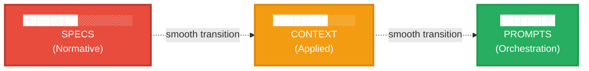
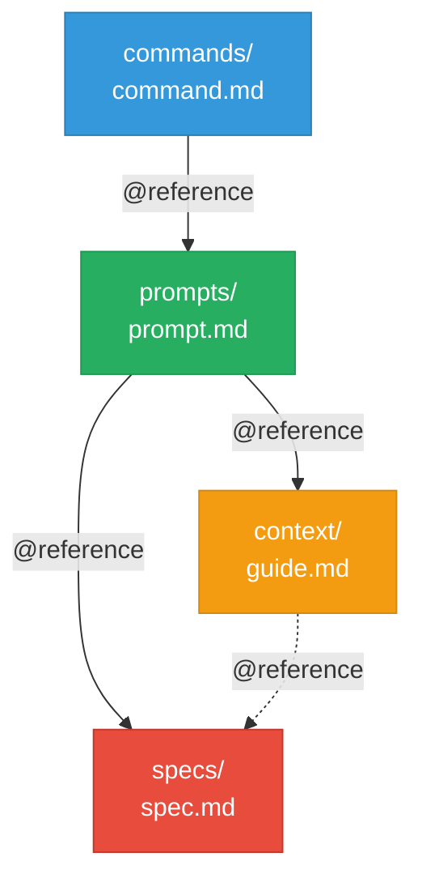
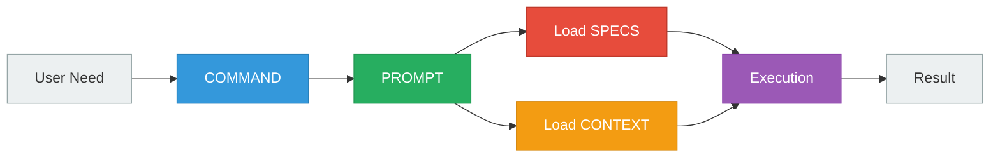

# Gradient Specifications

Complete technical specifications for the Gradient layered architecture.

---

## Core Specifications

Gradient is defined by three foundational specifications:

### 1. Architecture Specification

**Purpose**: Complete normative definition of Gradient architecture

**Defines**:
- The 7 architectural layers
- Layer responsibilities and boundaries
- Composition rules and reference syntax
- Validation rules and anti-patterns
- Implementation guidelines for LLMs

[Read: `gradient/spec/architecture-spec.md`](https://github.com/daviguides/gradient/blob/main/gradient/spec/architecture-spec.md)

### 2. Anti-Duplication Principles

**Purpose**: Universal principles for preventing duplication

**Defines**:
- Single Source of Truth (SSOT) philosophy
- Detection symptoms (red flags)
- Prevention strategies (reference vs duplicate)
- Refactoring workflows
- Validation checklists

[Read: `gradient/spec/anti-duplication-principles.md`](https://github.com/daviguides/gradient/blob/main/gradient/spec/anti-duplication-principles.md)

### 3. Layer Specification

**Purpose**: Technical specification of each layer

**Defines**:
- Required file structure per layer
- Content rules (MUST/MUST NOT)
- Validation criteria
- Quality metrics
- Examples of valid structures

[Read: `gradient/spec/layer-spec.md`](https://github.com/daviguides/gradient/blob/main/gradient/spec/layer-spec.md)

---

## Architecture Overview

### The Gradient Metaphor



Like a visual gradient, each layer **dissolves into** the next:
- SPECS → CONTEXT: From rules to application
- CONTEXT → PROMPTS: From patterns to action

**Not** rigid boundaries, but **smooth, intentional transitions**.

---

## Layer 1: SPECS (Normative)

### Purpose
Authoritative source of truth for definitions, rules, and standards.

### Contains
- Format definitions
- Syntax rules
- Validation criteria
- Semantic specifications
- Standards and conventions

### Does NOT Contain
- Working examples (→ CONTEXT)
- Implementation guides (→ CONTEXT)
- Orchestration logic (→ PROMPTS)
- Meta-instructions for LLMs (→ PROMPTS)

### File Patterns
- `*-spec.md` - Format specifications
- `*-principles.md` - Foundational principles
- `*-rules.md` - Normative rules
- `*-standards.md` - Standards definitions

### Quality Metrics
- **Completeness**: 100% (all concepts defined)
- **Normative ratio**: >80% (normative vs descriptive text)
- **Independence**: High (minimal external dependencies)

### Example

```markdown
# Format Specification

**Purpose**: Define complete structure of XYZ format.

## Core Concept

XYZ files MUST contain:
1. Metadata section (required)
2. Content section (required)
3. Footer section (optional)

### Metadata Section

Required fields:
- `id`: Unique identifier (snake_case)
- `version`: Semantic version (MAJOR.MINOR.PATCH)

## Validation Rules

Valid XYZ file if:
- All required sections present
- Metadata fields valid
- Syntax follows specification
```

---

## Layer 2: CONTEXT (Applied)

### Purpose
Practical application of specifications through examples and guides.

### Contains
- Working examples
- Implementation patterns
- Decision trees
- Practical guides
- Best practices in action

### Does NOT Contain
- Syntax definitions (→ SPECS)
- Format rules (→ SPECS)
- Normative statements (→ SPECS)
- Orchestration logic (→ PROMPTS)

### File Patterns
- `examples.md` - Complete working examples
- `*-guide.md` - Implementation/decision guides
- `patterns.md` - Architectural patterns
- `faq.md` - Common questions with applied answers

### Quality Metrics
- **Reference ratio**: >30% (references to SPECS)
- **Unique value**: High (not duplicating specs)
- **Completeness**: 100% (examples work)
- **Practical utility**: High (solves real problems)

### Example

```markdown
# Implementation Guide

For format rules: @../project-spec/format-spec.md

## Getting Started

To create your first file:
1. Define metadata (see format spec for requirements)
2. Add content sections
3. Validate structure

### Example Setup

```yaml
meta:
  id: my_first_file
  version: 1.0.0
```

## Common Patterns

### Pattern 1: Simple Structure
[Applied example with explanation]
```

---

## Layer 3: PROMPTS (Orchestration)

### Purpose
Dynamic orchestration that loads specs/context and provides meta-instructions.

### Contains
- `@` references to SPECS and CONTEXT
- Meta-instructions for LLMs
- Orchestration logic
- Context loading sequences

### Does NOT Contain
- Inline spec content (>5 lines per section)
- Inline examples (→ CONTEXT)
- Any duplicated material from SPECS or CONTEXT

### File Patterns
- `load-*.md` - Context loaders
- `*-workflow.md` - Multi-step orchestrations
- `validate-*.md` - Validation prompts

### Quality Metrics
- **Reference ratio**: >50% (@ references / total lines)
- **Inline content**: <5 lines per section
- **Duplication**: 0% (no repeated content)
- **Clarity**: High (task definition clear)

### Example

```markdown
# Load Context Prompt

**Purpose**: Load format specifications and implementation knowledge.

## Format Specifications (Normative)

@../project-spec/format-spec.md
@../project-spec/syntax-spec.md

## Applied Knowledge (Practical)

@../context/implementation-guide.md
@../context/examples.md

## Your Task

With these specifications and guides loaded, you can now:
1. Create new files following format spec
2. Validate existing files
3. Guide users on implementation
```

---

## Layer 4: COMMANDS (API Entry Points)

### Purpose
Thin API layer mapping one-to-one with PROMPTS.

### Structure
```markdown
<!-- commands/load-context.md -->
Load project context for development.

@../prompts/load-context.md
```

### Characteristics
- Maximum 5 lines total
- Single `@` reference to corresponding PROMPT
- No business logic
- One-to-one mapping with prompts

### Quality Metrics
- **File size**: ≤5 lines
- **Reference count**: Exactly 1
- **Logic**: 0 (no business logic)

### Analogy
Like **REST API routes** - define the interface, delegate the logic.

---

## Layer 5: AGENTS (Specialized Contexts)

### Purpose
Spin-off processes with isolated contexts and separate permissions.

### Structure
```markdown
# Architecture Reviewer Agent

You are an architecture reviewer specialized in Gradient compliance.

## Context

@../gradient/spec/architecture-spec.md
@../gradient/spec/anti-duplication-principles.md

## Your Task

Review provided project structure for compliance.

## Return Format

Return summary containing:
- Compliance status (pass/fail)
- Issues found (list)
- Recommendations (list)
```

### Characteristics
- Run independently from main context
- Have separate tool access
- Return summarized results
- Don't contaminate main context

### Quality Metrics
- **Role clarity**: High
- **Task specificity**: High
- **Return format**: Explicit
- **Context loading**: Via references

---

## Layer 6: SCRIPTS (Efficiency Layer)

### Purpose
Code execution when more efficient than LLM tokens.

### When to Use
- Repetitive tasks (file system scans)
- Performance-critical operations (large file processing)
- Validation logic (format checking)
- Automation (bulk operations)

### Structure
```bash
#!/bin/bash
# Script: validate-structure.sh
# Purpose: Validate Gradient project structure compliance
# Usage: validate-structure.sh <project-path>

set -e

PROJECT_PATH="$1"

# Validation logic
required_dirs=("spec" "context" "prompts")

for dir in "${required_dirs[@]}"; do
    if [ ! -d "$PROJECT_PATH/$dir" ]; then
        echo "ERROR: Missing required directory: $dir"
        exit 1
    fi
done

echo "Structure validation passed"
```

### Quality Metrics
- **Single responsibility**: Yes
- **Error handling**: Present
- **Documentation**: Complete
- **Testability**: High

---

## Layer 7: HOOKS (Event-Driven)

### Purpose
Lifecycle event handlers for automated workflows.

### Structure
```markdown
# Pre-Command Validation Hook

**Triggered on**: Before command execution

**Purpose**: Validate architecture compliance before running commands.

## Action

@../prompts/validate-architecture.md

## Configuration

Skip validation for commands:
- help
- version
```

### Events
- Pre-command execution
- Post-command execution
- File changes
- Context switches

### Characteristics
- Lightweight (avoid heavy processing)
- Clear trigger event
- References PROMPTS for logic

---

## Layer Interactions

### Reference Flow



### Information Flow



---

## Validation Targets

| Layer | Duplication | Reference Density | File Size | Completeness |
|-------|-------------|-------------------|-----------|--------------|
| **SPECS** | 0% | N/A | Variable | 100% |
| **CONTEXT** | 0% | >30% | <500 lines | 100% |
| **PROMPTS** | 0% | >50% | <200 lines | N/A |
| **COMMANDS** | 0% | 100% | ≤5 lines | N/A |
| **AGENTS** | 0% | Variable | Variable | N/A |

**Project-wide target**: Duplication ratio ≤ 1.1

---

## Reference Syntax

### Absolute References

```markdown
@~/.claude/gradient/gradient/spec/architecture-spec.md
```

### Relative References

```markdown
@../gradient/spec/architecture-spec.md  # Up one level
@./examples.md                          # Same directory
```

### Resolution Rules
1. Paths are relative to current file
2. Use `../` to go up directories
3. Use `./` for same directory
4. Never use system-absolute paths

---

## Next Steps

- [Quick Start]() - Build your first project
- [Architecture Guide]() - Deep dive with diagrams
- [Examples]() - Real-world implementations
- [Tools]() - Validation and metrics

---

**Questions?** Check the [Architecture Guide]() for detailed explanations and Mermaid diagrams.
