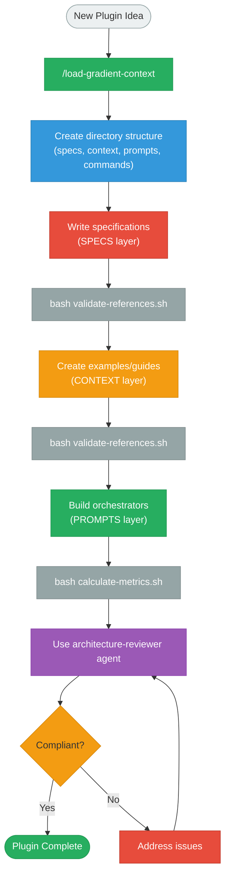
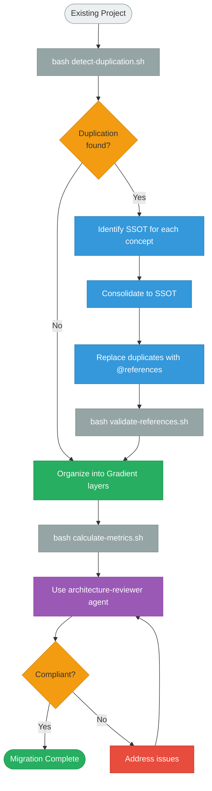

# Tools and Integration

Validation scripts, specialized agents, and commands for working with Gradient architecture.

---

## Validation Scripts

Gradient includes bash scripts for automated validation and quality assurance.

### validate-references.sh

**Purpose**: Validate all `@` references resolve correctly.

**Location**: `~/.claude/gradient/scripts/validate-references.sh`

**Usage**:
```bash
bash ~/.claude/gradient/scripts/validate-references.sh <project-path>
```

**What it checks**:
- Finds all markdown files with `@` references
- Resolves relative paths from each file
- Verifies referenced files exist
- Reports broken references with context

**Example output**:
```bash
$ bash validate-references.sh my-plugin/

Validating references in my-plugin...

Checking: prompts/load-context.md
  ✓ @../project/spec/format-spec.md → /path/to/project/spec/format-spec.md
  ✓ @../context/examples.md → /path/to/context/examples.md

Checking: context/examples.md
  ✓ @../project/spec/format-spec.md → /path/to/project/spec/format-spec.md

All references valid ✓
```

**Error example**:
```bash
$ bash validate-references.sh my-plugin/

ERROR: Broken reference in prompts/load-context.md
       Reference: @../project/spec/missing.md
       Resolved to: /path/to/project/spec/missing.md (not found)
```

**When to use**:
- After creating new prompts/context files
- Before committing changes
- During refactoring
- As part of CI/CD pipeline

---

### detect-duplication.sh

**Purpose**: Detect potential content duplication across files.

**Location**: `~/.claude/gradient/scripts/detect-duplication.sh`

**Usage**:
```bash
bash ~/.claude/gradient/scripts/detect-duplication.sh <project-path>
```

**What it checks**:
- Extracts significant text blocks (headers, paragraphs)
- Compares files for common content
- Reports similarities with ≥3 common lines
- Highlights potential SSOT violations

**Example output**:
```bash
$ bash detect-duplication.sh my-plugin/

Scanning for duplications in my-plugin...

Extracting significant blocks...
Comparing files...

Potential duplication found:
  File 1: prompts/create-workflow.md (lines 15-22)
  File 2: project/spec/format-spec.md (lines 45-52)
  Common lines: 8
  Similarity: High

Review these files for consolidation to SSOT.

---

No significant duplication detected ✓
```

**When to use**:
- During initial project assessment
- When migrating to Gradient
- After major content changes
- To identify refactoring opportunities

**Interpreting results**:
- **High similarity (>5 lines)**: Likely needs consolidation
- **Medium similarity (3-5 lines)**: Review for SSOT
- **Low similarity (<3 lines)**: Acceptable overlap

---

### calculate-metrics.sh

**Purpose**: Calculate Gradient architecture quality metrics.

**Location**: `~/.claude/gradient/scripts/calculate-metrics.sh`

**Usage**:
```bash
bash ~/.claude/gradient/scripts/calculate-metrics.sh <project-path>
```

**What it calculates**:
- Duplication ratio (total lines / unique information lines)
- Reference density (for prompts)
- Command file sizes
- Layer compliance
- Total files per layer

**Example output**:
```bash
$ bash calculate-metrics.sh my-plugin/

=== Gradient Architecture Metrics ===

Project: my-plugin/

Layer Distribution:
  SPECS:    3 files (1,200 lines)
  CONTEXT:  4 files (800 lines)
  PROMPTS:  3 files (150 lines)
  COMMANDS: 3 files (9 lines)
  AGENTS:   2 files (250 lines)

Quality Metrics:
  Duplication Ratio:     1.05  (target: ≤1.1) ✓ PASS
  Reference Density:     72%   (target: >50%) ✓ PASS
  Avg Command Size:      3 lines (target: ≤5) ✓ PASS

Project-wide:
  Total Files:           15
  Total Lines:           2,409
  Maintenance Points:    3 (SPECS)

Status: ✓ COMPLIANT
```

**Metrics explained**:

**Duplication Ratio**:
```
Total Lines / Unique Information Lines

Target: ≤1.1 (10% acceptable overlap)
Warning: >1.2 (20% duplication)
Danger: >1.3 (30% duplication - requires refactoring)
```

**Reference Density (for PROMPTS)**:
```
@ References / Total Lines

Target: >50% (majority should be references)
Warning: 30-50% (moderate inline content)
Danger: <30% (too much duplication)
```

**Command File Size**:
```
Average lines per command file

Target: ≤5 lines (thin wrappers)
Warning: 6-10 lines
Danger: >10 lines (contains business logic)
```

**When to use**:
- After major structural changes
- To validate project compliance
- Before releases
- To track quality over time

---

## Specialized Agents

Gradient provides agents with isolated contexts for specialized tasks.

### architecture-reviewer

**Purpose**: Validate Gradient architecture compliance.

**Location**: `~/.claude/gradient/agents/architecture-reviewer.md`

**Usage** (in Claude Code):
```
Use the architecture-reviewer agent to validate my project structure.
```

**What it validates**:

**Layer boundaries**:
- SPECS contain only normative content
- CONTEXT references SPECS appropriately
- PROMPTS are thin orchestrators (>50% references)
- COMMANDS are thin wrappers (≤5 lines)

**Duplication detection**:
- Each concept exists in exactly one place
- No repeated content across files
- Clear SSOT for every definition

**Reference integrity**:
- All `@` references resolve
- No circular dependencies
- Proper relative path usage

**Structural compliance**:
- Required directories present
- File naming conventions followed
- Layer organization correct

**Return format**:
```json
{
  "status": "pass" | "fail",
  "duplication_ratio": 1.05,
  "reference_density": 0.72,
  "issues": [
    {
      "severity": "error" | "warning",
      "file": "prompts/example.md",
      "line": 15,
      "message": "Inline content exceeds 5 lines"
    }
  ],
  "metrics": {
    "total_files": 15,
    "total_lines": 2409,
    "specs_count": 3,
    "context_count": 4,
    "prompts_count": 3
  },
  "recommendations": [
    "Consider extracting inline content to context layer",
    "Validate command file sizes meet ≤5 line requirement"
  ]
}
```

**When to use**:
- Before releasing plugin
- After major refactoring
- When uncertain about architecture compliance
- To get structured validation report

---

## Commands

Gradient provides slash commands for loading and working with context.

### /load-gradient-context

**Purpose**: Load Gradient architecture specifications and implementation knowledge.

**Location**: `~/.claude/gradient/commands/load-gradient-context.md`

**Usage**:
```
/load-gradient-context
```

**What it loads**:
- Complete architecture specifications (SPECS)
- Implementation guides and examples (CONTEXT)
- Anti-duplication principles
- Layer specifications
- Quality metrics and validation criteria

**When to use**:
- Before creating new Gradient project
- When working on plugin architecture
- To understand Gradient patterns
- For validation assistance

**After loading**:
You can ask Claude Code:
- "Create a Gradient-compliant project structure for X"
- "Validate this prompt file against Gradient specs"
- "Where should this content live (SPECS/CONTEXT/PROMPTS)?"
- "How do I eliminate duplication in these files?"

---

## Integration Patterns

### CI/CD Integration

**GitHub Actions example**:
```yaml
name: Validate Gradient Architecture

on: [push, pull_request]

jobs:
  validate:
    runs-on: ubuntu-latest
    steps:
      - uses: actions/checkout@v2

      - name: Install Gradient
        run: |
          bash -c "$(curl -fsSL https://raw.githubusercontent.com/daviguides/gradient/main/install.sh)"

      - name: Validate References
        run: |
          bash ~/.claude/gradient/scripts/validate-references.sh .

      - name: Check Duplication
        run: |
          bash ~/.claude/gradient/scripts/detect-duplication.sh .

      - name: Calculate Metrics
        run: |
          bash ~/.claude/gradient/scripts/calculate-metrics.sh .
```

**Pre-commit hook**:
```bash
#!/bin/bash
# .git/hooks/pre-commit

echo "Validating Gradient architecture..."

# Validate references
if ! bash ~/.claude/gradient/scripts/validate-references.sh .; then
    echo "ERROR: Broken references detected"
    exit 1
fi

# Check duplication
if ! bash ~/.claude/gradient/scripts/detect-duplication.sh .; then
    echo "WARNING: Potential duplication detected"
    # Note: Don't fail commit, just warn
fi

echo "Validation passed ✓"
```

### Editor Integration

**VSCode Task**:
```json
{
  "version": "2.0.0",
  "tasks": [
    {
      "label": "Validate Gradient",
      "type": "shell",
      "command": "bash ~/.claude/gradient/scripts/validate-references.sh ${workspaceFolder}",
      "problemMatcher": [],
      "group": {
        "kind": "test",
        "isDefault": true
      }
    },
    {
      "label": "Calculate Metrics",
      "type": "shell",
      "command": "bash ~/.claude/gradient/scripts/calculate-metrics.sh ${workspaceFolder}",
      "problemMatcher": []
    }
  ]
}
```

---

## Workflow Examples

### Creating a New Plugin



### Refactoring Existing Project



---

## Troubleshooting

### Broken References

**Error**: `ERROR: Broken reference in prompts/load-context.md`

**Solutions**:
1. **Check relative path**: References are relative to current file
   ```markdown
   <!-- From prompts/load-context.md -->
   @../project/spec/format-spec.md  # Up one level, then into project/spec/
   ```

2. **Verify file exists**: Ensure referenced file is present
   ```bash
   ls -la project/spec/format-spec.md
   ```

3. **Check spelling**: Typos in filenames or paths
   ```markdown
   @../project/spec/fromat-spec.md  # Wrong: "fromat"
   @../project/spec/format-spec.md  # Correct: "format"
   ```

### High Duplication Ratio

**Warning**: `Duplication Ratio: 1.5` (target: ≤1.1)

**Solutions**:
1. **Find duplicated content**:
   ```bash
   bash detect-duplication.sh my-plugin/
   ```

2. **Identify SSOT**: Determine which file should be authoritative
   - Normative definitions → SPECS
   - Examples → CONTEXT
   - Meta-instructions → PROMPTS

3. **Consolidate**: Move content to SSOT location

4. **Replace with references**:
   ```markdown
   <!-- Before: duplicated content -->
   ## Format Rules
   [50 lines of spec content]

   <!-- After: reference -->
   ## Format Rules
   @../project/spec/format-spec.md
   ```

5. **Validate**:
   ```bash
   bash calculate-metrics.sh my-plugin/
   ```

### Low Reference Density

**Warning**: `Reference density: 0.3` (target: >0.5 for prompts)

**Solutions**:
1. **Extract inline content**: Move to SPECS or CONTEXT
   ```markdown
   <!-- Before: too much inline content -->
   ## Rules
   Files must have these sections:
   - meta (required)
   - content (required)
   - footer (optional)
   [... 40 more lines ...]

   <!-- After: reference -->
   ## Rules
   @../project/spec/format-spec.md
   ```

2. **Use more references**: Break large specs into smaller, referenceable pieces

3. **Keep meta-instructions brief**: <5 lines per section

---

## Next Steps

- **[Quick Start]()** - Create your first Gradient project
- **[Best Practices]()** - Guidelines for using tools effectively
- **[Examples]()** - See tools in action on real projects

---

**Key Takeaway**: Gradient provides automated validation and quality assurance through scripts, agents, and commands. Use them frequently to maintain zero duplication and architectural compliance.
