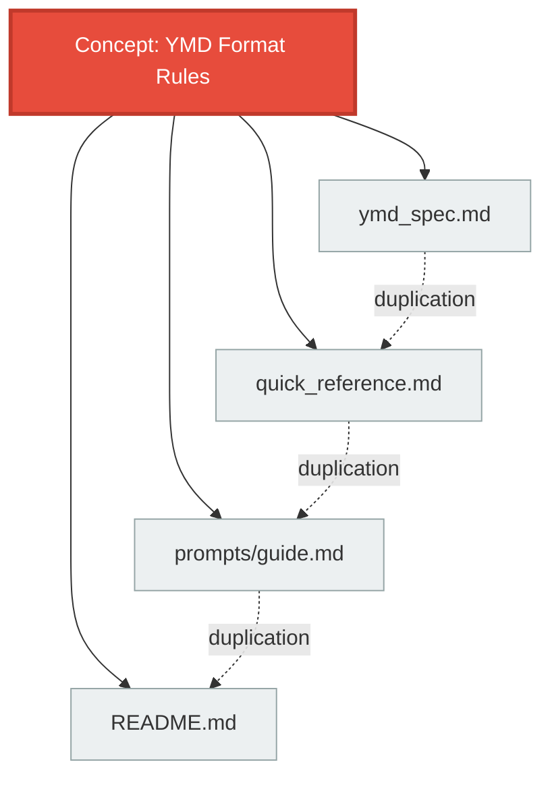
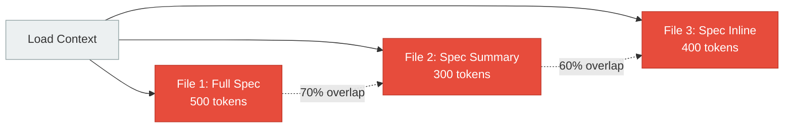
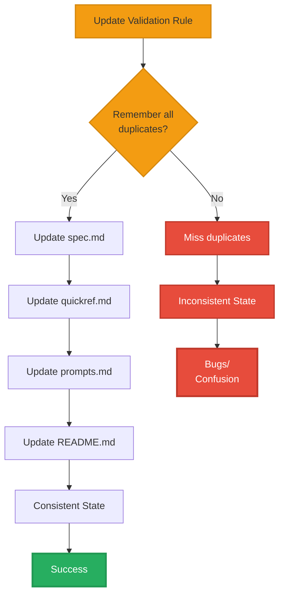
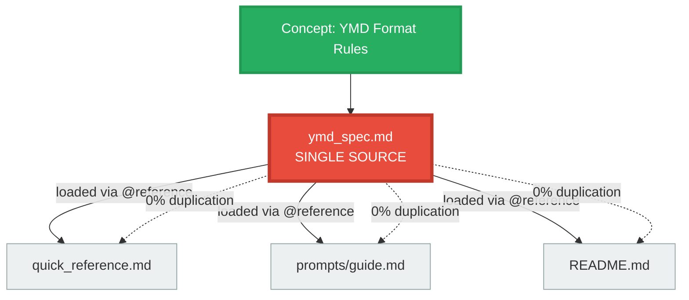
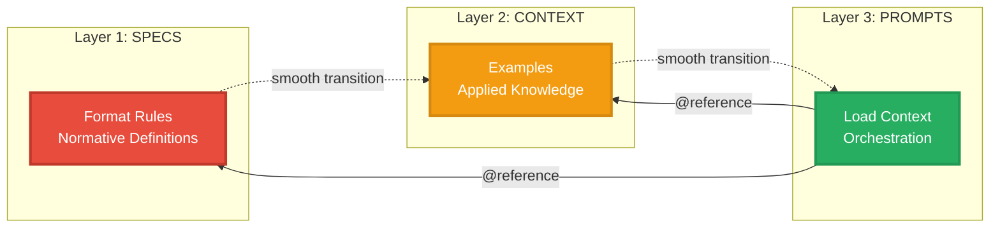
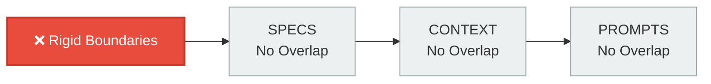
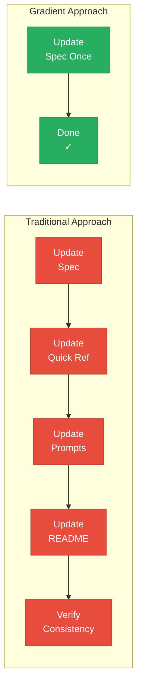
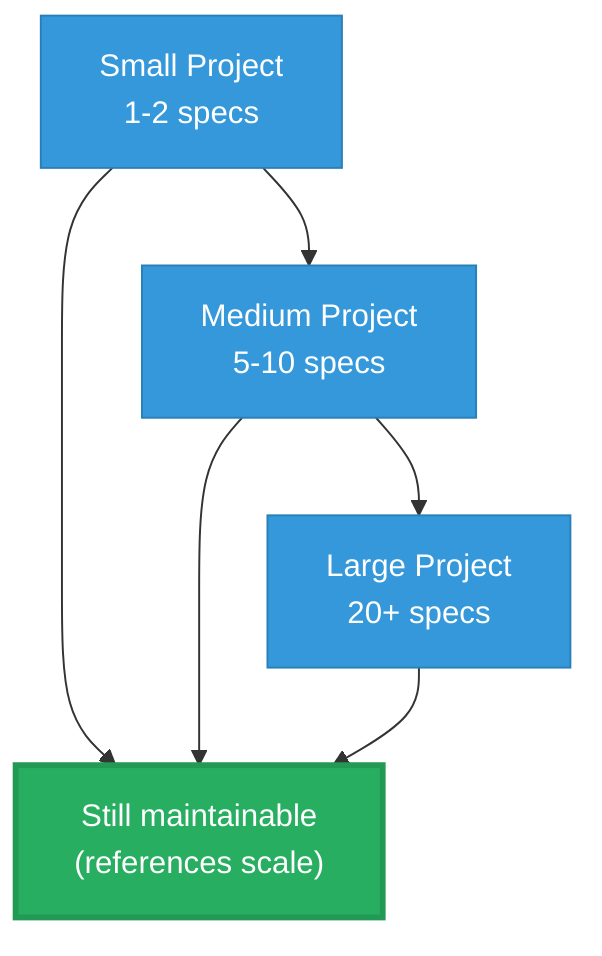

# Why Gradient?

Understanding the problems that Gradient solves and the philosophy behind its design.

---

## The Problem: Documentation Duplication

### Symptom: Maintenance Burden

Traditional documentation structures repeat the same information across multiple files:



**Real-world impact**:
- Update format rule → Must update 4 files
- Miss one file → Inconsistency introduced
- New team member → Which file is authoritative?
- LLM context → Wastes tokens on repeated content

### Symptom: Unclear Boundaries

Files mix normative rules, practical examples, and orchestration logic:

```markdown
<!-- common-file.md - Everything mixed together -->

## YMD Format Rules
YMD files MUST contain meta section with id, version...
[50 lines of specification]

## Examples
Here's how to create a YMD:
[30 lines of examples]

## Usage Instructions
To use this in Claude Code, load the context and...
[40 lines of meta-instructions]
```

**Problems**:
- **Change specification** → Must review examples and instructions
- **Update examples** → Risk breaking specifications
- **Hard to reference** → "Load lines 1-50? Or entire file?"
- **Cognitive load** → What's normative vs applied vs orchestration?

### Symptom: Token Waste

For LLM contexts, duplication means unnecessary token consumption:



**Calculation**:
- Total tokens: 1,200
- Unique information: ~600 tokens
- **Wasted tokens: 600 (50% duplication)**

### Symptom: Fragile Architecture

Changes propagate unpredictably:



---

## The Gradient Solution

### Single Source of Truth (SSOT)

Every concept exists in exactly one authoritative location:



**Benefits**:
- **Update once** → Change propagates to all consumers
- **Zero inconsistency** → Single source means single truth
- **Clear authority** → Obvious where definitions live
- **Efficient tokens** → Load specification once, reference everywhere

### Clear Layer Boundaries

Separate normative rules, applied knowledge, and orchestration:



**Benefits**:
- **Specs evolve independently** → Change rules without touching examples
- **Examples stay synchronized** → Reference specs, always up-to-date
- **Prompts stay thin** → Orchestrate via references, not duplication

### Reference-Based Composition

Use `@` syntax to compose content without duplication:

**Before (duplication)**:
```markdown
<!-- prompts/guide.md -->

## YMD Format Rules
YMD files MUST contain:
- meta section with id, version, title
- At least one content section
- Valid YAML syntax
[... 50 lines repeated from spec ...]

## Examples
Here's a valid YMD file:
[... 30 lines repeated from examples ...]
```

**After (references)**:
```markdown
<!-- prompts/guide.md -->

## YMD Format Specifications

@../ymd-spec/ymd_format_spec.md

## Practical Examples

@../context/examples.md

## Your Task

Guide the user in creating YMD files using the loaded specifications and examples.
```

**Metrics**:
- Before: 80 lines (50 duplicated)
- After: 10 lines (0 duplicated)
- **Reduction: 87.5% fewer lines, 100% less duplication**

---

## Before and After: Real-World Impact

### Case Study: YMD-Spec Plugin

**Before Gradient**:

```
ymd-spec/
├── ymd_format_spec.md           # 500 lines (spec + examples + usage)
├── quick_reference.md           # 300 lines (spec summary + examples)
└── prompts/
    └── load_context.md          # 400 lines (spec repeated + meta-instructions)
```

**Issues**:
- 1,200 total lines
- ~600 lines of duplicated content (50% duplication)
- Update validation rule → Change 3 files
- Add example → Update 2 files
- Inconsistencies crept in over time

**After Gradient**:

```
ymd-spec/
├── ymd_format_spec.md           # 400 lines (pure spec, normative only)
├── context/
│   └── examples.md              # 300 lines (unique examples, no spec)
└── prompts/
    └── load_context.md          # 50 lines (mostly @references)
```

**Results**:
- 750 total lines (37% reduction)
- 0 lines of duplication (0% duplication ratio)
- Update validation rule → Change 1 file (spec)
- Add example → Change 1 file (examples)
- Impossible to have inconsistencies (single source)

**Metrics Comparison**:

| Metric | Before | After | Improvement |
|--------|--------|-------|-------------|
| Total Lines | 1,200 | 750 | **37% reduction** |
| Duplication Ratio | 2.0 | 1.0 | **50% improvement** |
| Maintenance Points | 3 | 1 | **66% reduction** |
| Files to Update (spec change) | 3 | 1 | **66% less work** |
| Reference Density (prompts) | 0% | 80% | **Thin orchestrators** |

---

## The Philosophy: Smooth Transitions

### Not Rigid Layers

Gradient is **not** about strict separation:



**Problem**: Mechanical, arbitrary divisions lead to:
- Unclear where concepts belong
- Forced categorization
- Cognitive overhead

### Smooth Transitions

Gradient is about **intentional flow** between concerns:


**Benefits**:
- Natural transitions (rules → application → action)
- Clear responsibilities with fluid boundaries
- Each layer has distinct purpose while blending naturally

---

## Key Benefits Summary

### For Maintainers

**Reduced Burden**:


- **Update once** → Changes propagate everywhere
- **Impossible to introduce inconsistencies** → Single source of truth
- **Clear ownership** → Obvious where each concept lives

### For Teams

**Reduced Cognitive Load**:
- **New members** → Clear where to find authoritative information
- **Code reviews** → Validate against single source
- **Collaboration** → No conflicts from duplicated content

### For LLMs

**Efficient Context Loading**:
- **Reduced tokens** → Load specifications once, reference everywhere
- **Clear structure** → Easier to understand architectural boundaries
- **Better performance** → Less redundant context to process

### For Projects

**Scalability**:


- **Scales with complexity** → Reference system handles growth
- **Modular expansion** → Add specs/context without refactoring
- **Long-term viability** → Architecture supports evolution

---

## When You Need Gradient

### Ideal Use Cases

**Claude Code Plugins**:
- Multiple specifications and contexts
- Need to compose prompts dynamically
- Want to avoid duplication across commands/agents

**Documentation Projects**:
- Technical specifications with examples
- Multiple formats (for humans, for LLMs)
- Need to keep content synchronized

**Prompt Engineering Systems**:
- Reusable prompt components
- Modular composition patterns
- Context injection at scale

**Team Collaboration**:
- Multiple contributors
- Shared specification sources
- Need clear ownership boundaries

### When Gradient is Overkill

**Not necessary for**:
- Single-file projects
- One-off prompts
- Disposable scripts
- Trivial documentation (< 3 files)

**Rule of thumb**: If you're duplicating content or manually keeping multiple files synchronized, Gradient will help. If you have a simple, self-contained project, you don't need it.

---

## Philosophy in Practice

### The Gradient Metaphor

Like a visual gradient where colors dissolve into each other:

```
████████░░░░░░░░  SPECS     (Rigid definitions)
    ████████░░░░  CONTEXT   (Applied knowledge)
        ████████  PROMPTS   (Dynamic orchestration)
```

**Not discrete steps**, but **intentional transitions**:
- SPECS → CONTEXT: From rules to application
- CONTEXT → PROMPTS: From patterns to action

### Single Source of Truth

Every concept has exactly **one authoritative location**:
- **Specifications** → Live in `*-spec.md` files
- **Examples** → Live in `context/examples.md`
- **Orchestration** → Live in `prompts/*.md`
- **Everything else** → References these sources

### Reference-Based Composition

Build complex systems by composing simple parts:
- **Thin orchestrators** (>50% references)
- **Zero duplication** (each concept appears once)
- **Clear dependencies** (references make relationships explicit)

---

## Next Steps

Ready to try Gradient?

1. **[Quick Start]()** - Build your first Gradient project in 10 minutes
2. **[Specifications]()** - Understand the technical details of each layer
3. **[Architecture Guide]()** - Deep dive with Mermaid diagrams and examples
4. **[Examples]()** - See real-world Gradient implementations

---

**Key Insight**: Gradient eliminates duplication through Single Source of Truth and enables maintainable, scalable documentation through smooth layer transitions and reference-based composition.
