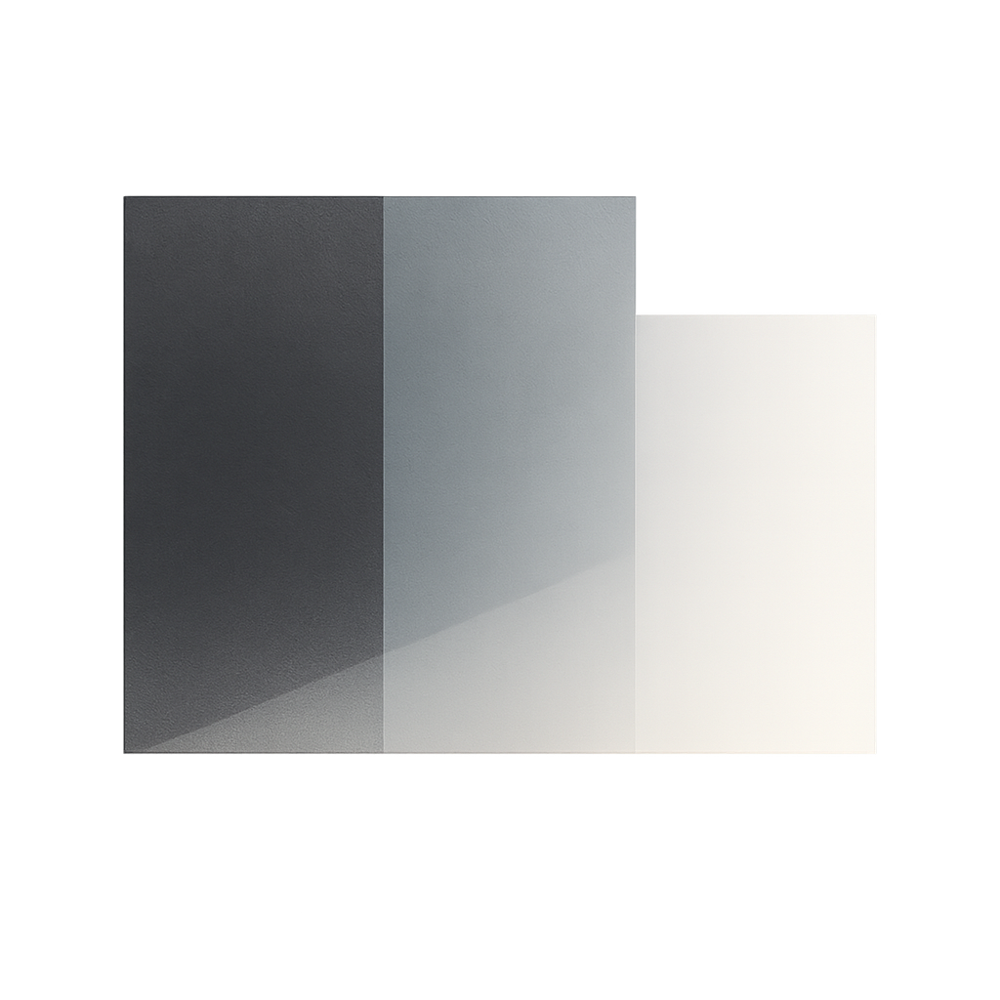

# Gradient

<blockquote style="border: none;">
  <p><strong>A proposal for a layered context architecture</strong></p>
</blockquote>

Architectural patterns for building maintainable Claude Code plugins through smooth layer transitions and zero duplication.

```
███▓▓▒▒░░░░  SPECS     (The WHAT - Normative)
  ███▓▓▒▒░░  CONTEXT   (The HOW - Applied)
     ██▓▓▒▒  PROMPTS   (The ACTION - Orchestration)
```

<br clear="right"/>

## Quick Start

### One-Line Installation (Claude Code Context)

```bash
bash -c "$(curl -fsSL https://raw.githubusercontent.com/daviguides/gradient/main/install.sh)"
```

Installs Gradient specifications to `~/.claude/gradient/` and loads context into your Claude Code environment.

### Plugin Installation (Claude Code Plugin)

```bash
git clone https://github.com/daviguides/gradient.git
cd gradient
./install.sh
```

**Verify**:
```bash
ls ~/.claude/gradient/
# Should show: gradient-spec/, context/, prompts/, commands/, agents/, scripts/
```

---

## Why Gradient?

### Problems Solved

**Before Gradient**:
- Context files repeating specification content
- Redundant explanations across multiple files
- Unclear boundaries between specs, context, and prompts
- Maintenance burden when changes require updates in multiple places
- Token waste from duplicated content

**With Gradient**:
- **Zero duplication** through Single Source of Truth (SSOT)
- **Clear responsibilities** with smooth layer transitions
- **Reference-based composition** using `@` syntax
- **Thin orchestrators** that load rather than duplicate
- **Efficient token usage** and easy maintenance

[Learn more →]()

---

## What is Gradient?

Gradient is an architectural framework for organizing Claude Code plugins and context injection systems.


### Core Concept

**Smooth transitions**, not rigid boundaries:
- SPECS → CONTEXT: From rules to application
- CONTEXT → PROMPTS: From patterns to action
- Like a visual gradient where colors dissolve into each other

### Architecture Layers

**7 Layers**:
1. **SPECS** - Normative definitions (THE WHAT)
2. **CONTEXT** - Applied knowledge (THE HOW)
3. **PROMPTS** - Orchestration (THE ACTION)
4. **COMMANDS** - API entry points
5. **AGENTS** - Specialized contexts
6. **SCRIPTS** - Automation efficiency
7. **HOOKS** - Event-driven workflows

[Full specifications →]()

---

## Documentation

<div style="display: grid; grid-template-columns: repeat(auto-fit, minmax(250px, 1fr)); gap: 20px; margin: 20px 0;">

<div style="border: 1px solid #ddd; padding: 15px; border-radius: 5px;">
<h3>Quick Start</h3>
<p>Get started in 5 minutes. Create your first Gradient project.</p>
<a href="">Get Started →</a>
</div>

<div style="border: 1px solid #ddd; padding: 15px; border-radius: 5px;">
<h3>Why Gradient?</h3>
<p>Understand the problems solved and benefits gained.</p>
<a href="">Learn Why →</a>
</div>

<div style="border: 1px solid #ddd; padding: 15px; border-radius: 5px;">
<h3>Specifications</h3>
<p>Complete technical specifications for all layers.</p>
<a href="">Read Specs →</a>
</div>

<div style="border: 1px solid #ddd; padding: 15px; border-radius: 5px;">
<h3>Architecture Guide</h3>
<p>Deep dive with Mermaid diagrams and patterns.</p>
<a href="">Explore →</a>
</div>

<div style="border: 1px solid #ddd; padding: 15px; border-radius: 5px;">
<h3>Examples</h3>
<p>Real-world implementations and patterns.</p>
<a href="">See Examples →</a>
</div>

<div style="border: 1px solid #ddd; padding: 15px; border-radius: 5px;">
<h3>Tools & Scripts</h3>
<p>Validation, metrics, and automation tools.</p>
<a href="">View Tools →</a>
</div>

</div>

---

## Tools & Integration

### Validation Scripts

```bash
# Validate @ references
bash scripts/validate-references.sh <project-path>

# Detect duplication
bash scripts/detect-duplication.sh <project-path>

# Calculate metrics
bash scripts/calculate-metrics.sh <project-path>
```

### Specialized Agents

```bash
# Architecture compliance review
@architecture-reviewer
```

### Claude Code Commands

```
/load-gradient-context    # Load architecture knowledge
```

[Full tool documentation →]()

---

## Real-World Examples

Gradient emerged from patterns discovered in:

**ymd-spec** - YMD/PMD format specification
**semantic-docstrings** - Python documentation standards
**code-zen** - Zen of Python implementation guide

[View detailed examples →]()

---

## Key Metrics

| Metric | Target | Benefit |
|--------|--------|---------|
| Duplication Ratio | ≤ 1.1 | Near-zero duplication |
| Reference Density (Prompts) | > 50% | Thin orchestrators |
| Command File Size | ≤ 5 lines | Clean API layer |
| Maintenance Points | 1 per concept | Update once, propagate everywhere |

---

## Community

### Contribute

Share your Gradient implementations and patterns:
- [GitHub Discussions](https://github.com/daviguides/gradient/discussions)
- [Submit Issues](https://github.com/daviguides/gradient/issues)
- [Pull Requests](https://github.com/daviguides/gradient/pulls)

### Philosophy

> "Architecture isn't about rigid layers—it's about smooth, intentional transitions."

Code like a gradient: from normative specs through applied context to dynamic action, smoothly.

---

## Get Started

1. [Install Gradient](#quick-start)
2. [Follow Quick Start Guide]()
3. [Explore Examples]()
4. [Build Your First Plugin](#)

**Ready to eliminate duplication?** [Get Started →]()

